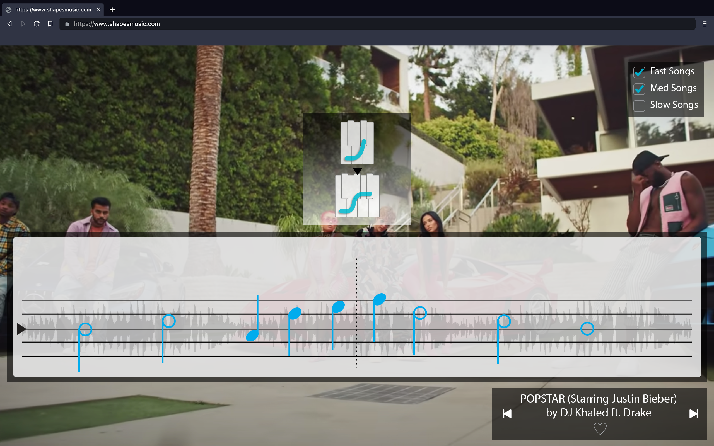

# Shapes

_A Music Method for the Expert Beginner_

### Shapes Basics Series

#### [1. A Shape](lessons/01-a-shape.md)
[Video Draft](https://www.youtube.com/watch?v=J1Ks_ve2h1I)

Use a single shape to play along with a playlist of songs. Hear when notes fit or don't fit, and start to follow your musical intuition.

#### [2. Different Shapes](lessons/02-different-shapes.md)
[Video Draft](https://www.youtube.com/watch?v=rvDND8zNJfw)

Add some different shapes and continue playing along with songs.

#### [3. A Group of Shapes](lessons/03-a-group.md)
[Video Draft](https://www.youtube.com/watch?v=d7obs-3YdOo)

See the shapes as a group, and add a way to name the shapes.

#### [4. Shape Fingerings](lessons/04-shape-fingerings.md)

- How hands match the keyboard, and how to play hands together in any shape, beginning on any note, using only one fingering pattern.

#### [5. The Anchor Note](lessons/05-the-anchor-note.md)

- Introduce the anchor, hear the pull, start to recognize it in songs.

#### [6. Playing With the Anchor](lessons/06-playing-with-the-anchor.md)

- Use the anchor note to focus your playing. Balance structure and play.

#### [7. Bass Notes](lessons/07-bass-notes.md)

- Introduce bass notes around the anchor. Hear them structuring the song. Use them to create additional structures.

#### [8. Matching A Shape](lessons/08-matching-a-shape.md)

- Match a song with a shape on your own. Start by using a diagram, then use adjacent notes to fill in the shape.

#### [9. Notes in Time](lessons/09-notes-in-time.md)

- Represent bass notes relative to the anchor using a staff instead of the keyboard. Then add a way to represent time.

#### [10. Changes](lessons/10-changes.md)

- Introduce changing shapes and anchors. Distinguish changes at the key and chord levels.

#### [11. Groups of Shapes](lessons/11-groups-of-shapes.md)

- Introduce three other groups of shapes and listen to their qualities. Relate the groups through their common shape names.

#### [12. Reading by Touch](lessons/12-reading-by-touch.md)

- Begin SR Tactile sequence through anchor, two higher, two lower, TOP shape only, Pe anchor. which will include a thumb pivot.

#### [13. A Tonescape and Tensions](lessons/13-a-tonescape-and-tensions.md)

- Introduce a tonescape and get into **passive** tensions (anchor-higher-lower)

#### [14. Imagination as an Instrument](lessons/14-imagination-as-an-instrument.md)

- Hearing notes inside a tonescape
- Anchor-higher-lower **active**

#### 15. Tensions Part 2 (Follows from 13)

- Add two higher and two lower tensions **passive**

#### [16. Reading by Ear](lessons/16-reading-by-ear.md)

- Begin SR Imagery sequence in the netural mood.
- Anchor, two higher, and two lower **active**

#### 17. Naming Tensions

- Switch the tensions naming model to 2nd, 3rd, 7th, 6th.

#### 18. Reading by Touch Part 2 (Follows from 12)

- Add 5L and 5R shapes to SR tactile sequence.
- Continue with anchor, one and two higher, one and two lower.

#### [19. Moods](lessons/19-moods.md) (Follows from 15)

- changing shapes on a single anchor introduces the idea of moods, and their spectrum of lightness/heaviness.
- add the single light and single heavy tonescapes
- anchor, 2nd, 3rd, 7th, 6th in neutral, single light & single heavy tonescapes **passive**

#### 20. Reading by Ear Part 2 (Follows from 16)

- SR Imagery sequence in neutral, single light, and single heavy moods
- anchor, 2nd, 3rd, 7th, 6th.

#### 21. Light & Heavy Tensions

- Introduce "light/heavy" tension names as a more specific way to name tensions that vary in different moods.
- The light/heavy mood names are a sum of their light/heavy tensions
- the tension number becomes something abstracted from the specific tension, which is how letter names (& traditional solfege) will work. This sets up IPs.

#### [22. Independent Solfege](lessons/22-independent-solfege.md)

- Introduce independent solfege names & distinguish from relative names.

#### [23. Reading by Touch Part 3](lessons/23-reading-by-touch-3.md) (Follows from 18)

- Introduce 4th and 5th to the SR tactile sequence (all tensions)
- Then add 4L and 4R shapes.

#### [24. Moods and Tensions Together](lessons/24-moods-and-tensions-together.md) (Follows from 19)

- Add 4th and 5th (all diatonic tensions)
- begin using light/heavy names for all tensions
- all diatonic tensions in neutral, single light & single heavy tonescapes **passive**

#### [25. Getting Inside of Moods](lessons/25-getting-inside-of-moods.md)

- Add double light & double heavy tonescapes, shuffle all.

#### 26. Reading by Ear Part 3 (Follows from 20)

- SR Imagery sequence through double light & heavy moods
- All diatonic tensions

#### 27. Incidentals

- Introduce incidentals as a way of notating tensions outside of the shape.

#### 28. Making Time Relative

- Introduce rhythmic note symbols as subdivisions
- Align different subdivisions with pulse dots, what looks best?
- Now possible to remove pulse dots (abstracts away from regular note spacing)

#### 29. Reading by Touch Part 4 (Follows from 23)

- Add 3L and 3R shapes to the SR tactile sequence.
- Continue all tensions, bring in some rhythmic note symbols.
- Any changing songs that use these shapes?

#### [30. All Moods and Tensions](lessons/30-all-moods-and-tensions.md) (Follows from 24/25)

- Add triple light & triple heavy tonescapes (all moods), shuffle all.
- Bring all tensions so far into the neutral tonescape. Relate to incidentals.

#### 31. Reading by Ear Part 4 (Follows from 26)

- SR Imagery sequence all moods
- All diatonic tensions
- Bring in some rhythmic note symbols

#### 32. Mood Names

- Introduce standard(ish) mood names in place of light/heavy names.
- Also name 2nd, 3rd, 4th group moods and relate their light/heavy positions.

#### 33. Reading by Touch Part 5 (Follows from 29)

- Add remaining (2L/R, 1L/R, B) shapes to the SR tactile sequence.
- Continue using rhythmic note symbols
- Play with changing songs
- Perhaps bring in some incidentals (if that works with songs)

#### 34. Holding on to the Anchor (Follows from 30)

- Continue all tensions so far into the neutral tonescape.
- Then drop the tonescape and stay oriented to the anchor.
- Try this with Indepent Solfege Names, too (gateway to Independent Relationship).

#### 35. Imagination as an Instrument Part 2

- Shuffle all tonescapes, all groups.
- Name the mood, and free play imagery inside of it.
