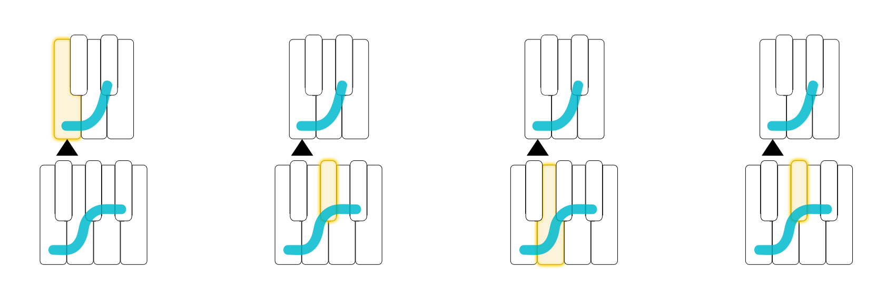
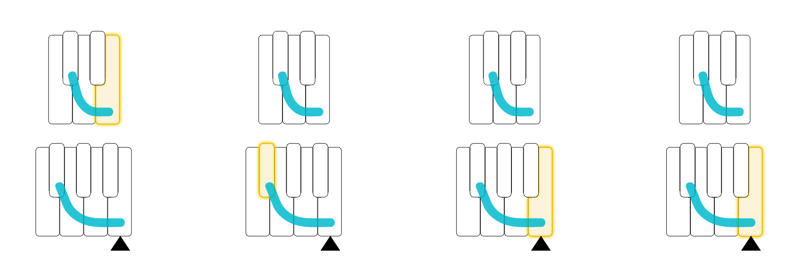
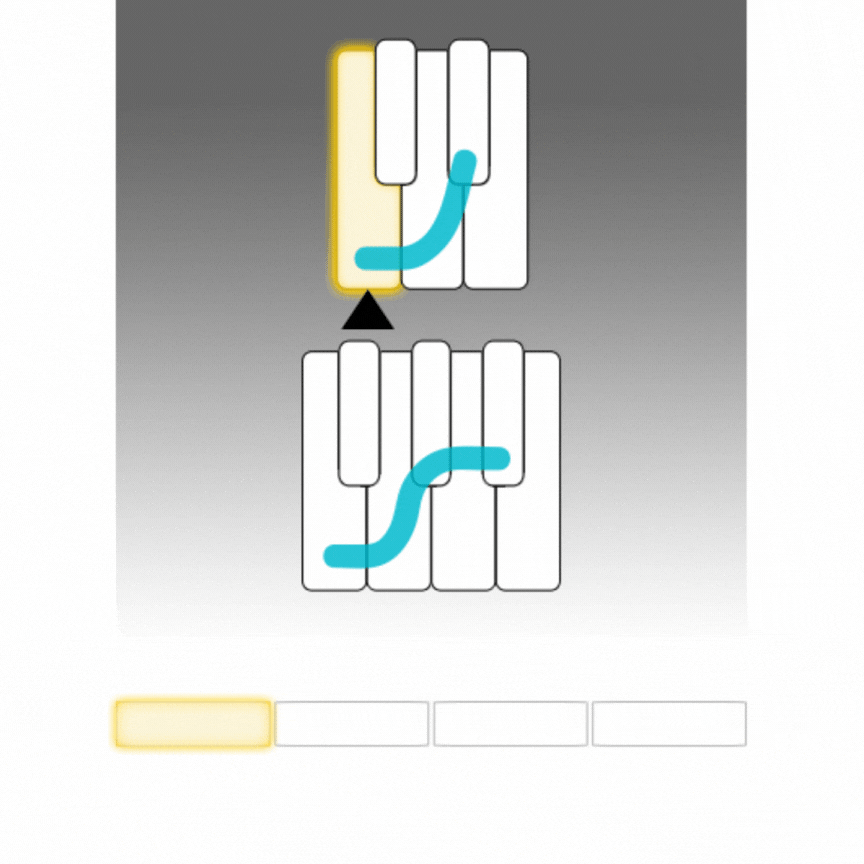
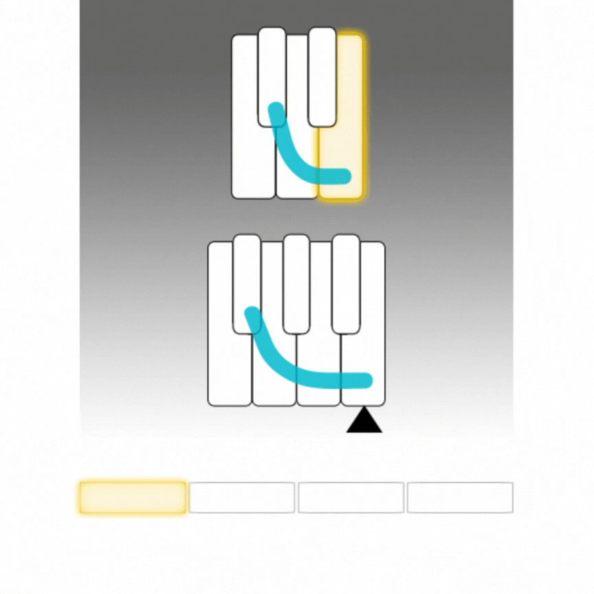
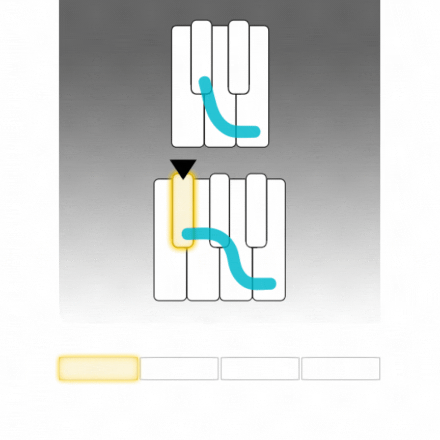
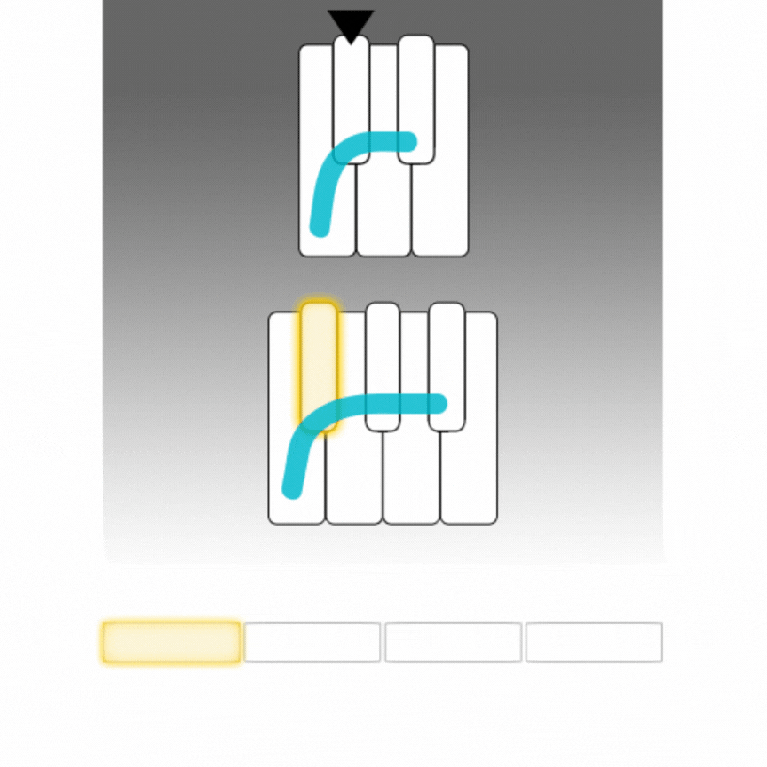
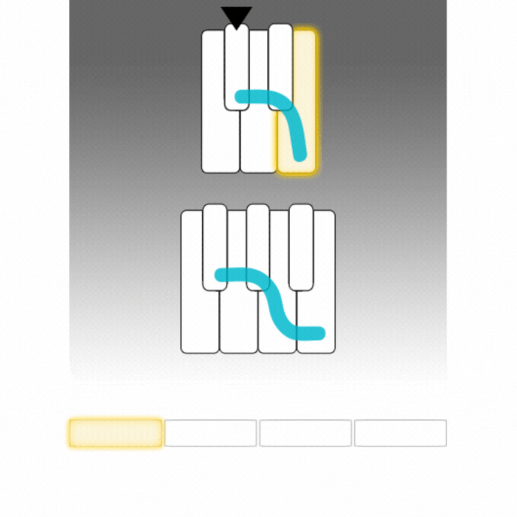
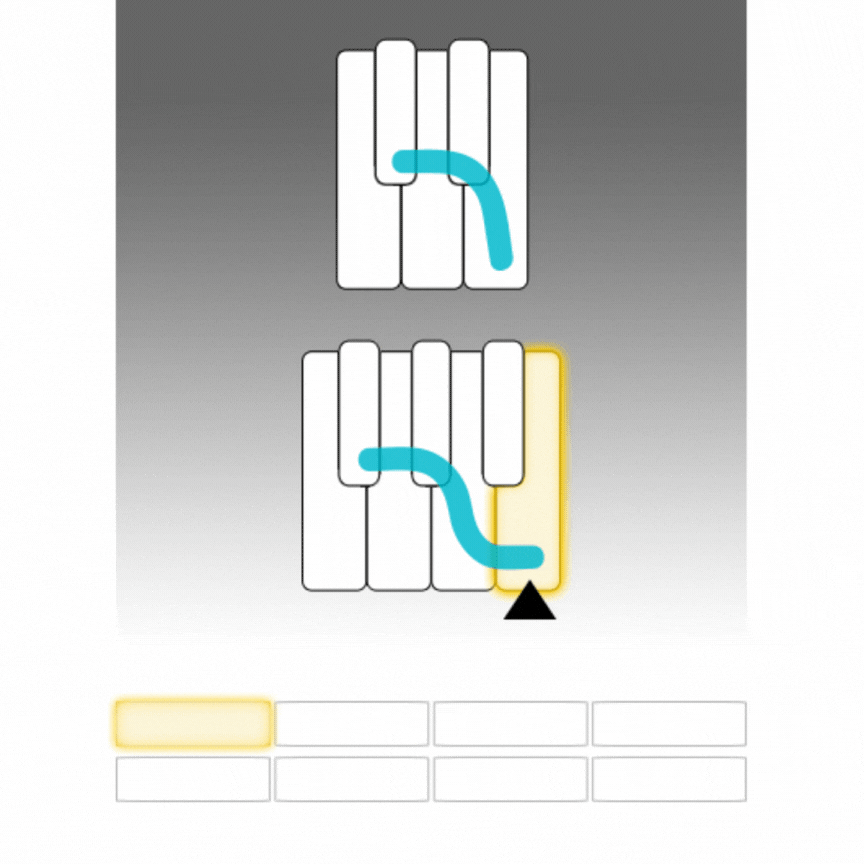
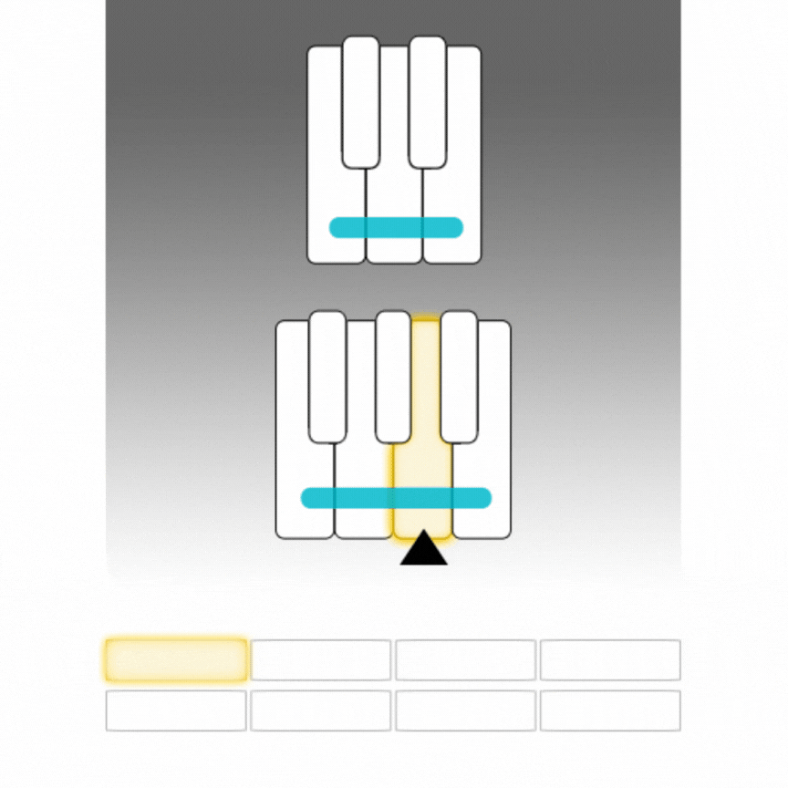

## Bass Notes

### Watch

[coming soon]

### Transcript

You've started using the shape and anchor to add some structure to your playing. And now, we'll extend this idea and make the shape start to feel distinctively like a song.

In lots of songs, you'll find a series of notes of the shape that are organized into repeating patterns around the anchor. These notes usually show up in the bass, so we'll call them *bass notes*.

[song]

For example, this song fits with 4 to the Right, with this anchor note [play w/beat].

And it has four bass notes that repeat throughout the song. The first note is the anchor [play], then here's the second note [play], third note [play], and fourth note [play].

These four notes repeat [play], over and over again, throughout the whole song.

[play, then switch song]

Here's another song. It fits with 2 to the Left, and the anchor note is here [play w/beat].

This song also has four bass notes, but instead of starting on the anchor, they end on the anchor. So the notes are [play]. And then they repeat throughout the song [play].

[stop song]

Hearing the bass notes in a song means you have to listen in a different way. You may be used to focusing on a song's melody, but here, you're listening for something more subtle, something that's more a part of the song's underlying structure. And this can take a little getting used to.

You can start by playing bass notes along with some different songs to get to know how they sound. For each new song, start by remembering its pattern of bass notes, so you have them in mind, along with the shape and the anchor.

Then listen for the exact moments in the song when the bass notes change, and try playing the notes in order, right at these moments.

This kind of listening will really start to draw you into the song in a new way. Even if you don't quite hear the bass notes *in* the song, you can still develop a feeling for the moments when they change. And since you already know what the bass notes are, you can also develop a feeling for when the notes you play match the bass notes in the song.

Once you've got the hang of matching bass notes in songs, there are two more things you can try out. First, you can use the bass notes, instead of the anchor note, to play with some of the ideas you came up with in the last lesson.

So maybe you'll choose to play three random notes of the shape at the same time along with the pattern of bass notes, like this [play].

Or maybe you'll play two different notes of the shape after each bass note, like this [play].

Or even skip every other note of the shape, starting from each new bass note, like this [play].

This opens a lot more possibilities you can play with. And when you feel comfortable playing around with the song, the second thing you can try is to turn the song off and play the bass notes on their own, along with notes of the shape.

Even if you squash down a whole bunch of notes of the shape [play] and play the bass notes along with it, you'll find that what you play really starts to sound like the song.

[play]

And once you branch off on your own, you can start to experiment with even more ideas, like using the bass notes and the shape to accompany yourself while you *sing* the song's melody. Or, you might try changing one or two of the bass notes to see how that sounds, or you can come up up with your own pattern of bass notes in the shape.

So give it a try. Start by playing along with a few different songs and really take your time listening. What matters most is that you start to develop a feeling for these moments when bass notes change in a song.

As you play, you'll also come across some songs that have more than one pattern of bass notes. So after the first pattern has repeated for a while, a new pattern will show up. These changing patterns feel like different sections of the song.

Experiment with this, and have fun. And when you feel like you've started to get the hang of hearing changing bass notes in a few different songs, that's when you're ready to come back for more.

### Example Songs

<a href="https://www.youtube.com/watch?v=JXgV1rXUoME" target="_blank">Doja Cat - You Right</a>  
(1 pattern, 4 bass notes)

<a href="https://www.youtube.com/watch?v=HEydV4B6mRQ" target="_blank">Rauw Alejandro & J Balvin - De Cora</a>  
(1 pattern, 4 bass notes)

<a href="https://www.youtube.com/watch?v=BC19kwABFwc" target="_blank">Dua Lipa - Love Again</a>  
(1 pattern, 4 bass notes)

<a href="https://www.youtube.com/watch?v=Zc3cxj5pDIs" target="_blank">Jason Aldean & Carrie Underwood - If I Didn't Love You</a>  
(1 pattern, 4 bass notes)

<a href="https://www.youtube.com/watch?v=ymIi1kLLmWw" target="_blank">Poo Bear - The Day You Left</a>  
(1 pattern, 4 bass notes)

<a href="https://www.youtube.com/watch?v=wvsP_lzh2-8" target="_blank">Lorde - Solar Power</a>  
(2 patterns, 4 bass notes each)

<a href="https://www.youtube.com/watch?v=CFMz9DOhaJ8" target="_blank">Ava Max - Every Time I Cry</a>  
(2 patterns, 4 bass notes each)

<a href="https://www.shapesmusic.com/bass-notes" target="_blank">More Bass Note Songs</a>

### Wireframe

