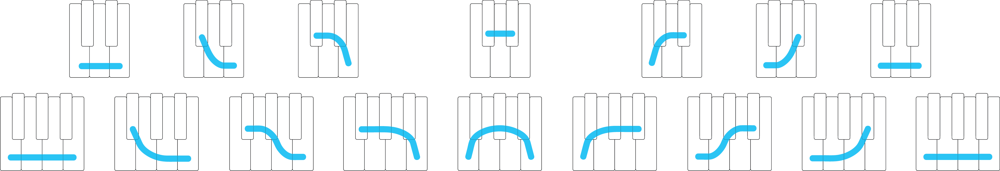
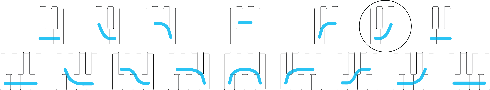
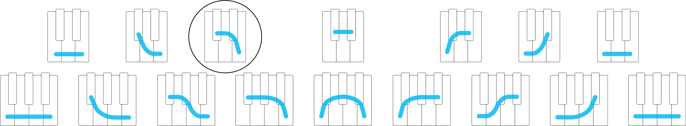
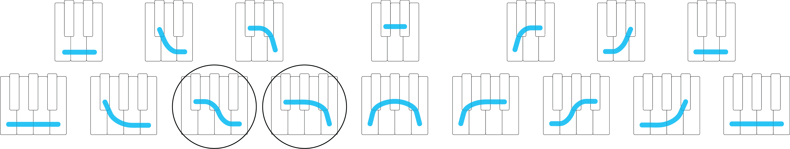
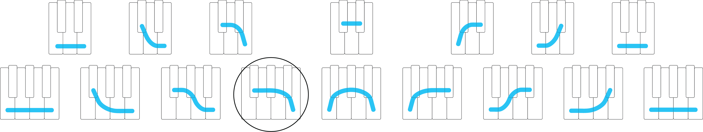
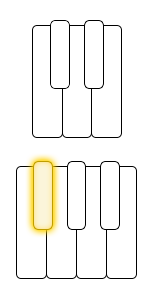
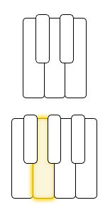
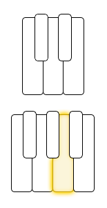
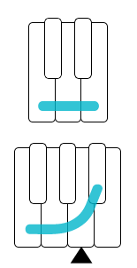
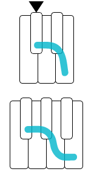

## Matching A Shape

### Transcript

Now that you have some experience playing along with songs, you're ready to figure out a song's shape on your own.

The easiest way to start is by looking at the whole group of shapes, and using a process of elimination.

[start song: 5L]

When a new song comes on, start by picking any one of the strokes in the top row [point], and play those notes along with the beat of the song.

So I'll pick this one:

And if I'm lucky it will fit with the song right away. So let's see [play].

Nope, that really doesn't fit.

The shapes that sound most alike are closest to each other in the group. So since this one didn't fit, let's try its opposite, which is pretty far away:

[play w/beat]

This sounds a lot better, but it's still not quite right. In fact, I can hear that the first and last notes sound like they fit, but the middle note doesn't. Since I'm close, I'll try another that's close by in the group. And I can see that one of the options right next to this one shares the same two notes that sounded like they fit:

[play w/beat]

And there we go, it fits.

Now that was the hard part, because the notes that fit in the *bottom* row will be one of the two options that are right next to the one that fits in the top row:

So I can try playing each group of notes along with the beat of the song...

[play w/beat]

And I hear right away that *this* one sounds better:

So now we've found the shape, and it's 5 to the Left.

[stop song]

Then, once you're a little more comfortable matching shapes, there's another, faster way to match.

[start song: 2R]

You start by playing any random note, and you'll hear right away if it fits or doesn't fit [play].

This note *doesn't* fit. And if it doesn't fit, the note immediately next to it, on either side, will [play].

And you can continue like this. For each pair of notes that are right next to each other on the keyboard, one will fit, and the other won't.

So if I compare the next two notes [alternate w/beat]:

*This* is the one that fits [play].

And when you continue this way, note by note, you'll start to recognize one of the shapes beginning to unfold.

[stop song]

Before long, you'll develop a sense for which note is the next note that fits, without having to play it first. It's as though you can *imagine* what pressing the next key will sound like, and the shape unfolds more and more quickly, after fewer and fewer notes.

So try matching some of the songs in the playlist on your own, and then check to see if you've picked the right shape. These techniques will help you get started, but gradually, you won't need them anymore, and you can let them drop away.

Now, if you guess a *different* shape than the one the playlist says fits with the song, really take your time to listen and compare the two shapes, because it's by comparing different options that you'll get better at matching.

And as you're listening and comparing, the idea is that you can start to figure out some techniques that work best for you. So for example, if you have trouble hearing whether a certain note fits, try listening instead for the notes that *don't* fit. It's also easier to hear if notes fit when you play along with the beat of the song. Or you can even try playing the same notes in a higher or lower register on the keyboard.

There's a real feeling of freedom that comes along with matching shapes on your own. For one thing, you'll start to feel like the world of songs you can play along with is bigger&mdash;much bigger&mdash;than will fit in any playlist.

But when you match shapes, you also have to begin trusting yourself a little more. In fact, if you decide that a certain shape fits with a song, and it's a *different* shape than the one in the playlist, that doesn't necessarily mean you've chosen the wrong shape.

Because some songs don't have enough information in them to match unquestionably with just one shape. And so two different people might hear different things in the same song.

Take <a href="https://www.youtube.com/watch?v=OQitfe8u7i4" target="_blank">this song</a> for example.  
[start song]

It has a great beat, but it's pretty hard to pin down, really, *any* notes that tell us which shape it might fit with.

So, as I start listening, I'd say it's this shape [play], because I hear this note [play] in the pitch of the bass drum, and then the rest of the notes feel like they match with the broader *style* of the song.

In fact, this shape sounds pretty great with the song [play].

But right about :50 seconds in, some bass notes start to come in, and then Ariana Grande sings a melody. And now, all of a sudden, the song sounds like it fits with a completely different shape [show].

 What amazing is that now, when you go back to the beginning of the song, it's almost impossible to hear it fitting with the original shape we played with.

So give it a try, and let the playlist be a guideline, rather than a rule, to help you match shapes on your own. And when you're starting to feel comfortable matching shapes on your own, that's when you're ready to come back for more.

### Playlist

<a href="../player/matching" target="_blank">Lesson 8 Playlist</a>
