## Notes In Time

### Watch

  <iframe src='https://www.youtube.com/embed/9JgYHum55hI?rel=0' frameborder='0' allowfullscreen></iframe>

### Transcript

So far, we've been using keys on the keyboard to represent changing bass notes in a shape, either by pointing to the notes, or by lighting them up.

But now I'd like to show you an even more versatile way to represent notes, using music notation. Here's how it works.

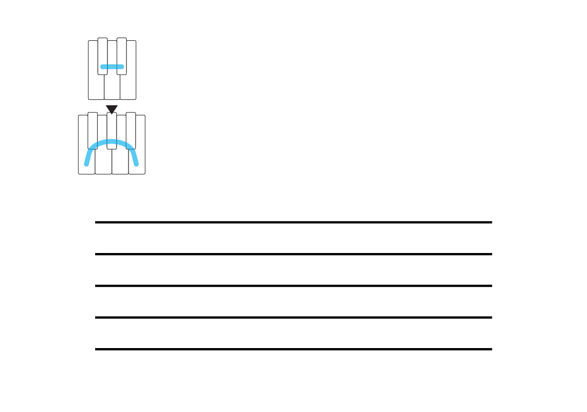

You start with the shape and anchor, but now you also have some horizontal lines below them. You can use as few or as many lines as you like, but *five* lines works pretty well, because it lets you represent a good range of notes, and it's easy to recognize each line's unique position relative to the other lines.

Now, you take the little arrow that we've been using to show which note is the anchor note, and place it on any one of the lines, or on any one of the spaces between the lines. I can put it anywhere, but I'll put it here, on the middle line [draw].

And now, when you draw a little circle on the line or space where you placed the anchor, that circle represents the anchor note [draw & play].

Then, one note of the shape *higher* than the anchor will be a circle on the next position higher, which is this space [draw & play]. The next note higher will be on the next line [draw & play], and so on.

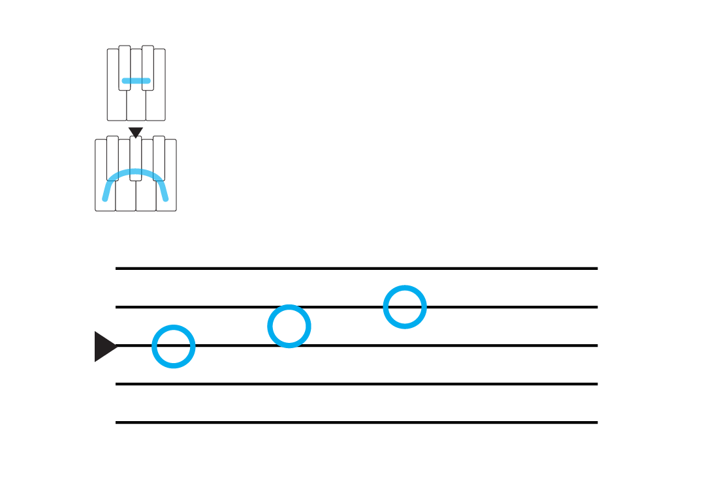

Or, you can draw notes *lower* than the anchor in the same way. Starting from the anchor, the next note of the shape lower will be a circle on the next position lower [draw & play], and so on [draw & play].

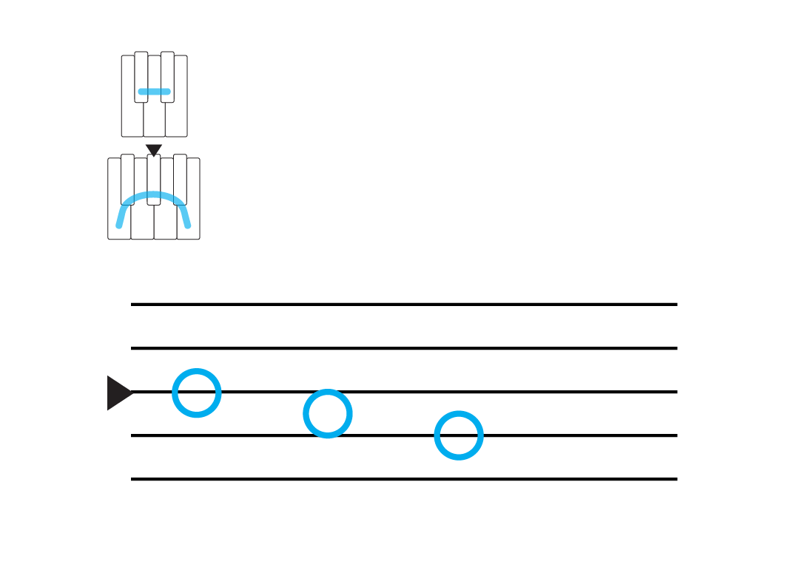

This means, if we look at the bass notes in a song [start song]:

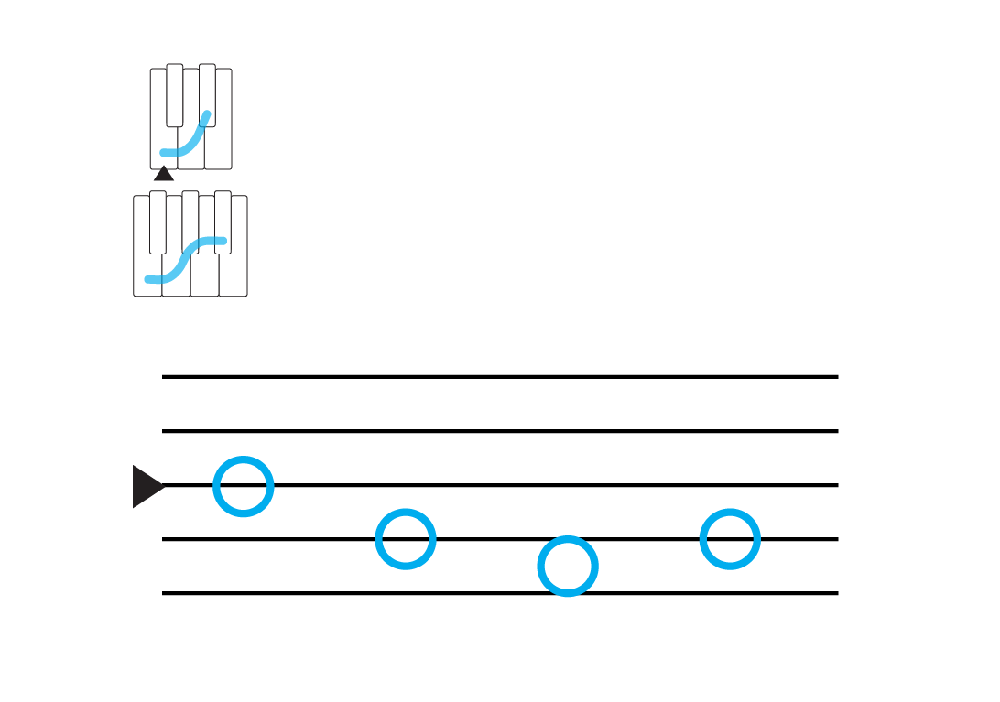

This is the anchor [point & play], the next bass note is one, two notes of the shape lower than the anchor [point & play], then the next note is three lower [point & play], and then back to two lower [point & play]. And the pattern repeats.

Or, for a different song:

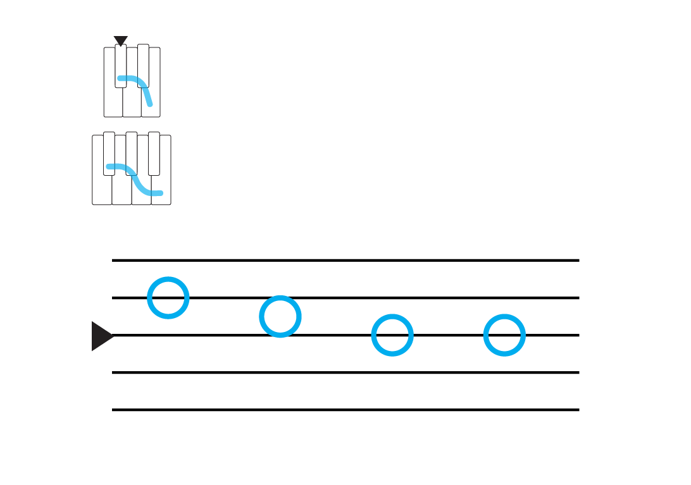

Here, the first bass note is one, two notes higher than the anchor [point & play], the next note is one higher [point & play], and then we're back to the anchor for the final two bass notes [point & play]. And the pattern repeats.

[stop song]

So the lines&mdash;and the spaces between them&mdash;represent the notes of the shape. And rather than pointing to a key on the keyboard and saying, "this note," the lines and spaces emphasize the *relationships* between notes of the shape&mdash;how much higher or lower they are from the anchor, and from one another.

So now you can say, "the note two lower than the anchor," and I'll know exactly which note you're talking about.

But that's not all the lines do. They also show us relationships between notes in *time*.

For one thing, the notes are written one after the other, which shows us their progression from one note to the next. And that's something you can't quite represent on the keyboard alone.

Beyond that, they the progression of time through the song. But it's not quite the same way a clock represents time. Instead, it's the time that arises from the song's regular beat, or *pulse*.

[start song]

You can *feel* a song's pulse, because it's the rate at which you most naturally move along to the song. So tap your foot, or bob your head, or dance along, and that's the pulse.

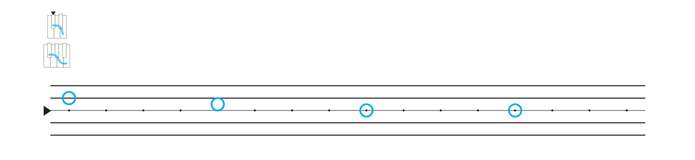

We can show the pulse by adding dots to the notation. Each dot represents one pulse, and now you can see *when* each note happens in the song, relative to the pulse, like this [point & play].

So give it a try. Keep playing along with songs that have changing bass notes, but now, you'll see the patterns as music notation, rather than as keys lit up on the keyboard.

You can also try using notation to write down some of your own ideas, like what you came up with playing with the anchor. And if you want to show two or more notes played at the same time, write them on top of one another, like this [draw & play].

Play around with this. And when you feel like you've started to get the hang of how music notation can represent what you play, that's when you're ready to come back for more.

### Example Songs

<a href="https://www.youtube.com/watch?v=JXgV1rXUoME" target="_blank">You Right - Doja Cat</a>  
(1 pattern, 4 bass notes)

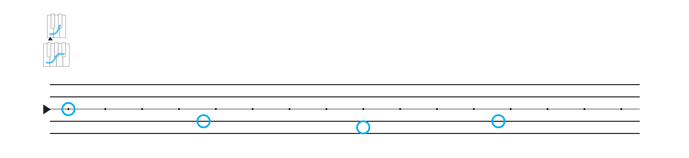

<a href="https://www.youtube.com/watch?v=HEydV4B6mRQ" target="_blank">De Cora - Rauw Alejandro & J Balvin</a>  
(1 pattern, 4 bass notes)

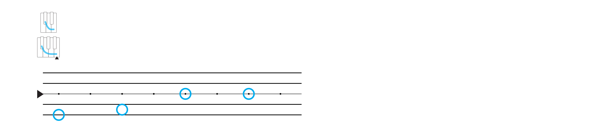

<a href="https://www.youtube.com/watch?v=BC19kwABFwc" target="_blank">Love Again - Dua Lipa</a>  
(1 pattern, 4 bass notes)

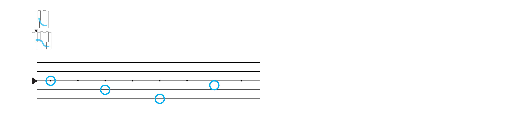

<a href="https://www.youtube.com/watch?v=Zc3cxj5pDIs" target="_blank">If I Didn't Love You - Jason Aldean & Carrie Underwood</a>  
(1 pattern, 4 bass notes)

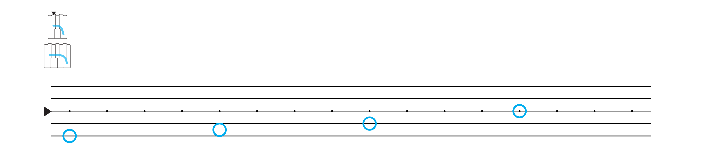

<a href="https://www.youtube.com/watch?v=ymIi1kLLmWw" target="_blank">The Day You Left - Poo Bear</a>  
(1 pattern, 4 bass notes)

<a href="https://www.youtube.com/watch?v=wvsP_lzh2-8" target="_blank">Solar Power - Lorde</a>  
(2 patterns, 4 bass notes each)

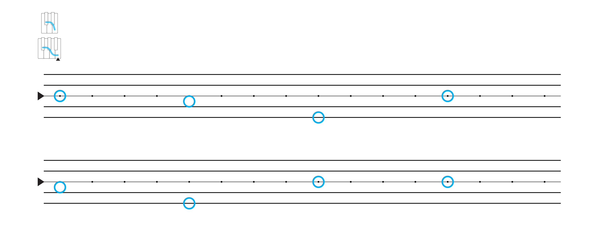

<a href="https://www.youtube.com/watch?v=CFMz9DOhaJ8" target="_blank">Every Time I Cry - Ava Max</a>  
(2 patterns, 4 bass notes each)

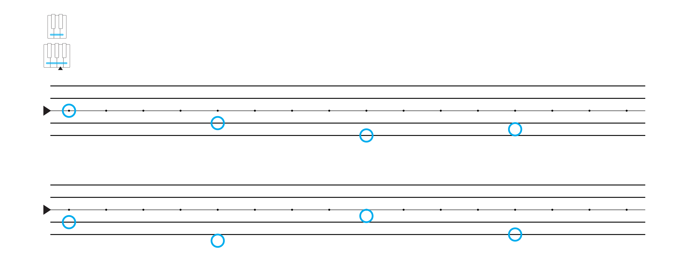

<a href="../player/bass-notes" target="_blank">More Bass Note Songs</a>

And a blank sheet to try on your own:

<embed
	src="https://shapesmusic.com/media/notation_blank.pdf"
	type="application/pdf"
	width="100%"
	height="500px"
/>
