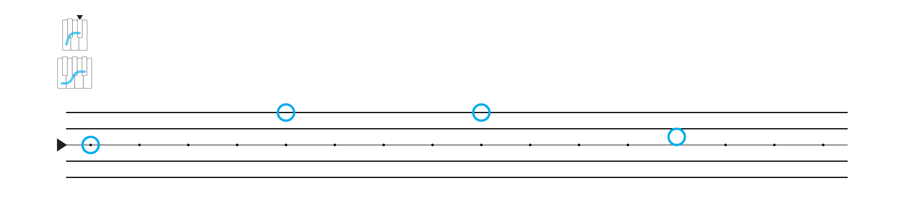
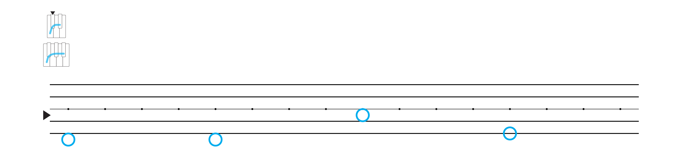
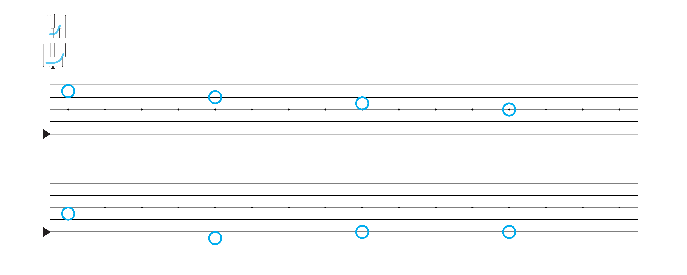
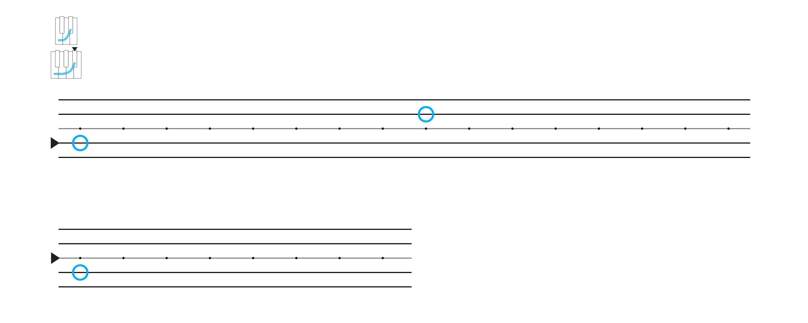
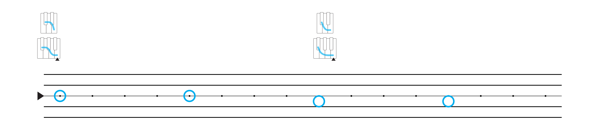
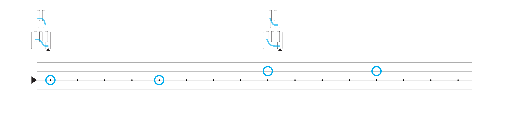
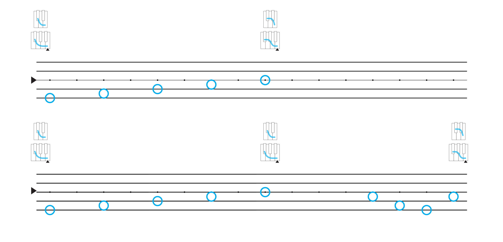

## Changes

  

### Watch

  <iframe src='https://www.youtube.com/embed/9JgYHum55hI?rel=0' frameborder='0' allowfullscreen></iframe>

### Transcript

You've developed a feeling for the moments when bass notes change in a song. But the shape can also change, and so can the anchor.

Luckily, you already have a lot of experience with changing shapes and anchors, because this is exactly what happens every time you switch to a new song in the playlist. Only now, we'll start playing with changes that happen in the *same song*.

You'll notice a change because you'll be playing along in the shape and anchor that fit with the song, and suddenly, they don't fit anymore, and a different shape or anchor does.

These moments of change tend to stand out even more than when just the bass notes are changing.

[start song: Clocks]

So, for example, in this song, we're playing along in 4 to the Right, with this note as the anchor [play], and a pattern of four repeating bass notes that change every four beats of the song [play].

And then all of a sudden, about 2 and a half minutes into the song...

[change]

The shape changes to 5 to the Right, the anchor moves one note lower, and there's a different pattern of bass notes [play].

[stop song]

This is a moment of change that really stands out, and it has a very different quality than the changes between bass notes.

Now, 4 to the Left and 5 to the Left are very similar shapes, with only one note that distinguishes them from one another [show]. And the changing anchor notes are also only one note apart in the shape [show]. So in one sense, this change may sound more subtle [play] than changing to a shape with very *few* notes in common, or to an anchor that's not in the original shape at all [play].

But there's a lot more happening in a song that can make a change stand out. The rhythm might also change, or there might be a pause, or the lyrics, or the instrumentation, or just the overall vibe of the song might change. So you can have a sensitivity to all of these things when you're starting to notice the different kinds of changes that can happen in a song.

So, here's another song

[start song: Roxanne]

This song fits with 2 to the Right, and here's the anchor [play w/beat].

It starts off with a repeating pattern of eight bass notes [play].

And then there's a new section of the song that repeats only the last four of these notes [play]. So shortening the pattern of bass notes is part of the feeling that we've moved into a new part of the song.

But then, a little over 2 minutes into the song, there's another change that feels much more substantial [play]. There's a pause, a buildup, and then suddenly the whole mood of the song changes. But here, the shape hasn't changed at all&mdash;only the anchor note has, to this note [play w/beat], 2 notes of the shape higher than before.

There's also a new pattern with only three bass notes, and they change much more slowly, every eight beats instead of every four [play].

[stop song]

Once you start playing along, you'll find that these moments of change begin to raise some very interesting questions. For example, in the first part of the song, the guitar usually plays right on the beat, but the bass doesn't [play song]. 

So when, exactly, does each new bass note change begin? Is it right when the bass plays a note, anticipated by what the guitar plays, or is it right on the beat, echoed by what the bass plays? I've *notated* the changes right on the beat, but the notes are a representation, and so they don't always quite match up with what you hear.

Let's look at one more example, where the changes happen on a smaller scale&mdash;not at new sections of the song, but just right along with the changing bass notes.

[start song: Take Back The Night]

This song switches back and forth between two different shapes&mdash;4 to the Left and 2 to the Left&mdash;every eight beats. The anchor note is the same throughout [play w/beat], but the bass notes change between the anchor and 1 note lower than the anchor, along with the changing shapes [play].

Although, you might decide that rather than changing to 1 note lower than the anchor, you hear the bass notes changing to 2 notes *higher* than the anchor [play, and I wouldn't try to argue with you.

But in either case, something really interesting is happening here. When the bass notes change along with the shape, the new bass note takes on the feeling, ever so slightly, of being a new anchor note. And yet, that new anchor still wants to pull back to the main anchor note of the song [play].

When you start paying attention to this, you'll find that it's true of all bass note changes, whether or not the shape changes along with them. So a bass note change is like an anchor change, only at a different, more subtle level, floating above the main anchor note of the song, and wanting to pull back to it.

Then, right about 1 minute in to the song, there's also a less subtle change, where the song takes on a different quality, and a new section begins [play].

One thing that happens here is that the shape *doesn't* change back to 4 to the Left when you expect it to. Instead, it stays in 2 to the Left a little longer, and brings in a series of bass notes that rise gradually back to the anchor, and the return to 4 to the Left [play].

This sounds really cool, and it adds to the feeling that you've moved into new part of the song by reversing your expectations from the earlier parts of the song.

So there's really no limit to the ways bass notes, shapes, and anchors can change in a song. And as you play along with more and more songs, you'll discover more and more different kinds of changes. You can even take some of these ideas and incorporate them with ideas of your own.

But no matter what you come across, you can always start to make sense of a change by asking if it's a bass note, shape, or anchor change, or a combination of these three kinds of changes.

So give it a try. Play along with some songs in the playlist to get a feeling for some different kinds of changes.

And since now you also know how to match shapes on your own, you can go out and try playing along with *any* song you hear, not just the songs in the playlist. 

Experiment with this and see what you come up with. And when you feel like you've started to notice moments of change in a song, and can play along with them, that's when you're ready to come back for more.

### Example Songs

<a href="https://www.youtube.com/watch?v=d020hcWA_Wg" target="_blank">Clocks - Coldplay</a>  
(bass note, shape, and anchor changes)

<a href="https://www.youtube.com/watch?v=3T1c7GkzRQQ" target="_blank">Roxanne - The Police</a>  
(bass note and anchor changes)

<a href="https://www.youtube.com/watch?v=DEzREJbln-o" target="_blank">Take Back The Night - Justin Timberlake</a>  
(bass note and shape changes)

<a href="https://shapesmusic.github.io/Player-Sketch/changes" target="_blank">More Changing Songs</a>

### Wireframe

