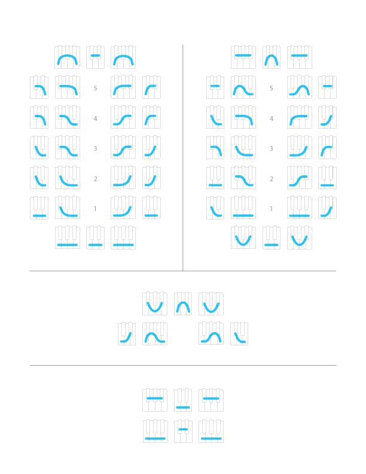

## Groups of Shapes

### Watch

  <iframe src='https://www.youtube.com/embed/9JgYHum55hI?rel=0' frameborder='0' allowfullscreen></iframe>

### Transcript

Now that you're matching shapes on your own, *and* you've gotten into songs with changes, I'd like to show you some different shapes you might come across as you're playing.

Now, by far, the majority of music you come across will fit with the shapes you already know.

But every so often, as you're playing [play], you might come across a moment like this [play], or this [play].

>  [example progression: T/T, T/K, 5R/N, *4R2/R*, 4R/B, *T3/D*, 3R/F.. maybe *4T/V*, *2R2/F*]

These moments feel very different, and they fit with different groups of shapes.

Here are *all* the groups of shapes you'll come across. The 1st group [point] is the one you already know, although here it's drawn a little differently. There's the TOP shape [point], 5 to the Left and Right, 4 to the Left and Right, and so on.

If you try playing some of the 2nd group shapes, like this one [point and play], or this one [point and play], or this one [point and play], you'll notice that they have a different feeling from the 1st group shapes. We might describe this feeling with words like "floaty," or maybe "mysterious."

The 2nd group has the same layout as the 1st group, and you'll recognize many of the same strokes, only arranged in different combinations. There's a TOP and Bottom shape [point], and with the exception of 5 to the Right and Left, the other shapes are also named by their number of top keys, and whether they're on the right or left side of the shape.

The 3rd group has only three shapes&mdash;a TOP shape [point and play] a Left shape [point and play], and a Right shape [point and play]. This group has yet a different feeling, that we can maybe describe as "tense," or "unsettled."

And the 4th group has two shapes&mdash;a TOP shape [point and play], and a Bottom shape [point and play]. These feel maybe a bit "dreamy," "spacey," or "ethereal."

In the playlist for this lesson, you'll find a bunch of songs that use these 2nd, 3rd, and 4th group shapes, sometimes just briefly, and sometimes for longer stretches of the song. 

So try playing along with some of these songs, and also experiment with the groups of shapes on your own to get a sense for the different feelings they create.

Anchor, and bass note, and shape changes work exactly the same way as in the 1st group, and you can also change *between* the groups. But especially since these shapes show up less often, keep your focus mostly on the 1st group and you'll get to know 2nd, 3rd, and 4th groups gradually, as you use them.

And when you feel like you've gotten to know some of the ways these new shapes might show up in your playing, that's when you're ready to come back for more.

### Example Songs

<a href="../player/other-groups" target="_blank">2nd, 3rd, and 4th Groups Playlist</a>

