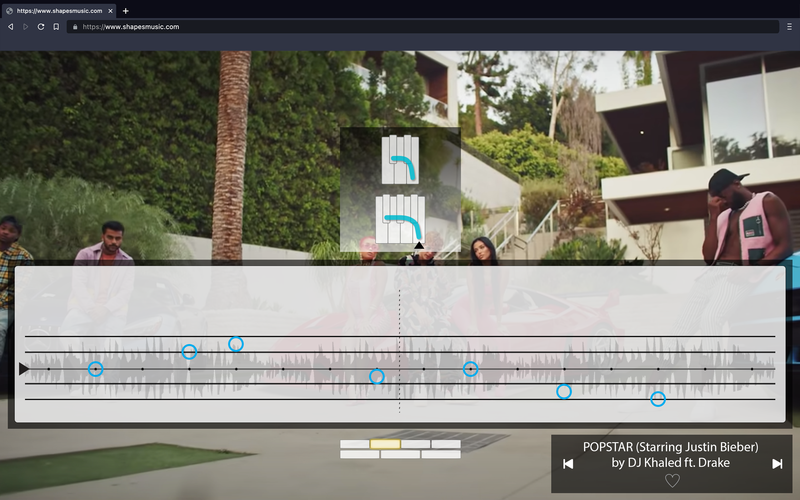
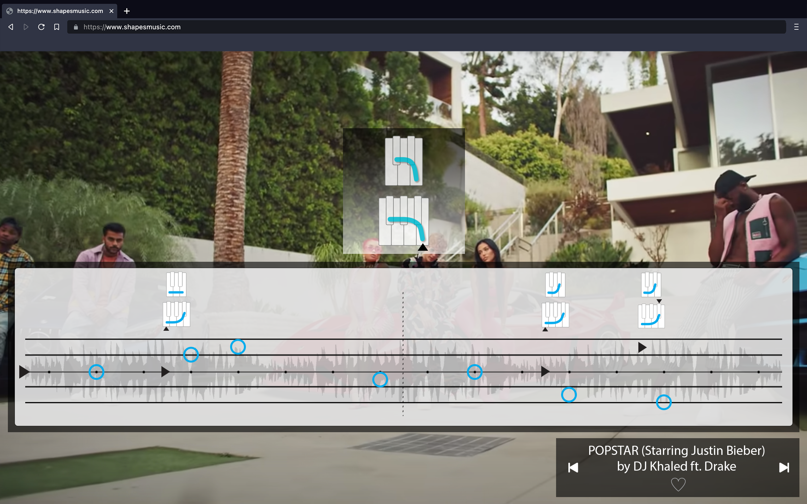
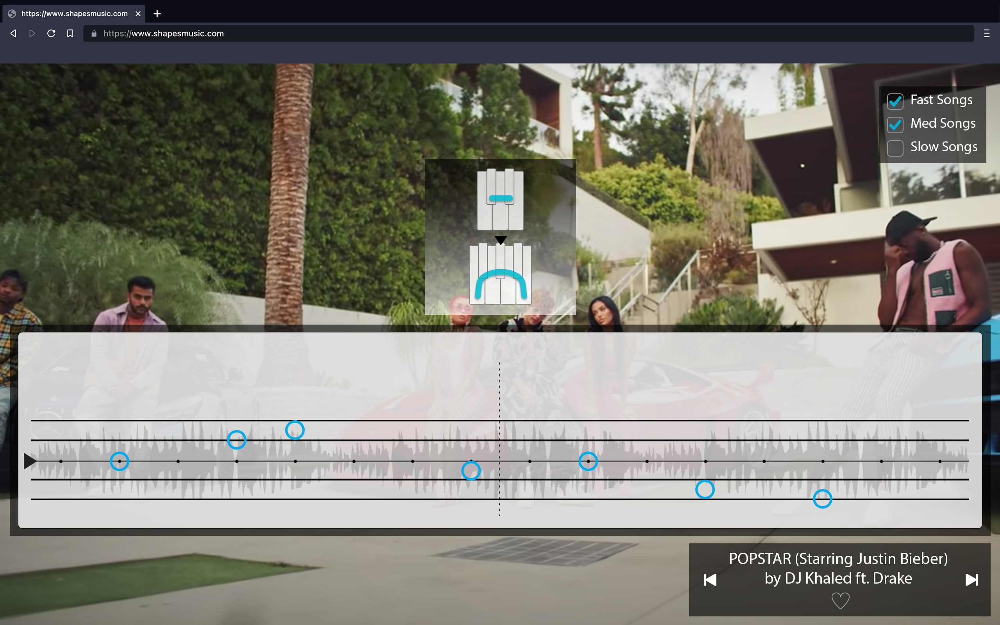
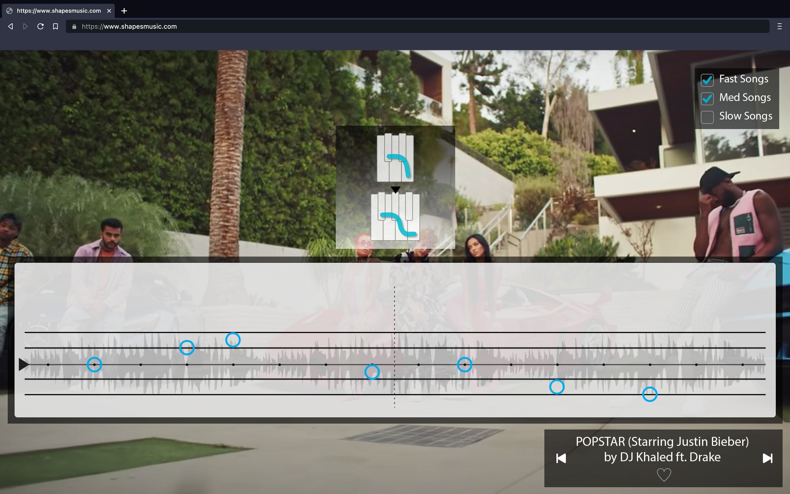
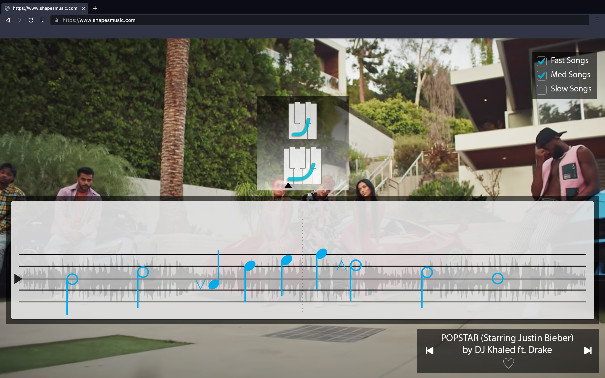

### Acknowledgments

**Location**

**References**

**Notes**

- this is a snapshot in a long project
- also a first way of introducing the software side of the project

### About

**Location**
- [about.md](writing/about.md)

**References**

**Notes**
- include Abstract
- colloquium as introduction
- not sure where this fits in a table of contents. front matter?
- Software as a medium:
  - There's an awful lot of thinking that goes on behind the scenes for a project like this. And a big part of the project for me, too, is trying to build something that works, that people can use, and that reflects the principles of the method all the way down to the details of how, say, note names are represented in the data model. that meant learning to code. I've tried to capture at least some of all this process in the devJournal. Link some particularly good examples.
  - you don't want the technology to do too much for you. that's a topic.

### Lesson 1 - A Shape

Use a single shape to play along with a playlist of songs. Hear when notes fit or don't fit, and start to follow your musical intuition.

**Location**

- [01-a-shape.md](lessons/01-a-shape.md)

**References**

- [2022-03-04 Draft YT Video](https://www.youtube.com/watch?v=J1Ks_ve2h1I)
- [2022-03-04 Slides Script](https://docs.google.com/presentation/d/1BbXmsq7Bd2WEPrBlTqApyb7zKrS8WmEEjb4qCe1gCv8/edit?usp=sharing)
- 2021-10-05 JG Shapes Lessons 1 & 2 (Video) start 14:27
- 2013-01-27 wireframes lesson 1 script
- 2009-10 lesson sketch - a shape

**Notes**

- Some good top shape songs:
  - Johnny & Mary

**Wireframes**

### Commentary - Why Music Videos?

**Location**

- [01-why-music-videos.md](writing/01-why-music-videos.md)

**References**

- 2023-Spring 4.SO_Mus notes (Intuition)
- [notebook/2022-07-23-Rereading-my-application-essay.md](notebook/2022-07-23-Rereading-my-application-essay.md)
- [notebook/2022-07-18-about-intro.md](https://github.com/davidforrest/notebook/blob/f56c2f3cd0a9c558c6c3b34a020d78f5632a24cf/2022-07-18-about-intro.md)
- [devJournal/Shapes-API/2020-11-07 Start playlisting again.md](https://github.com/davidforrest/devJournal/blob/main/Shapes-API/2020-11-07%20Start%20playlisting%20again.md#has-video)

**Notes**

### Lesson 2 - Different Shapes

Add some different shapes and continue playing along with songs.

**Location**

- [02-different-shapes.md](lessons/02-different-shapes.md)

**References**

- [2022-03-04 Draft YT Video](https://www.youtube.com/watch?v=rvDND8zNJfw)
- [2022-03-04 Slides Script](https://docs.google.com/presentation/d/15aEhmjdWSEs0JX3Uc00tF--RLqz0skjsV8oRaXVfQv8/edit?usp=sharing)
- 2021-10-05 JG Shapes Lessons 1 & 2 (Video) start 37:12
- 2015-10-25 videos 1 & 2 (archived in iMovie?)
- 2013-01-27 wireframes lesson 2 script

**Notes**

- Basics 2 & 3 were merged as 2A and 2B prior to 2022-03-04.

**Wireframes**

### Commentary - What Is a Shape?

**Location**

- [02-what-is-a-shape.md](writing/02-what-is-a-shape.md)

**References**

- 2023-Spring 4.SO_Mus notes
- 2023-Spring 2.EMP notes

**Notes**

- the last section "What *Is* a Shape?" feels a little long and a little repetitive. At some point, see if you can improve that?
- based on the commentary after Lesson 7 (bass notes), a shape is also distinguished from a key signature in that it always describes the chord level (!) and not the key level, except by coincidence if all the chords are described by the same shape. Which means key signature, like Major or Minor key in functional tonality, is an abstraction from the core experience of playing with shapes. And so the experience is a way of understanding, feeling that distance.
- add something about key signature at the chord level after the sentence: "And further, if the whole song is also in the same shape, then the shape will describe both an aspect of the song's key, and of its changing chords, at the same time. "

### Lesson 3 - A Group of Shapes

See the shapes as a group, and add a way to name the shapes.

**Location**

- [03-a-group.md](lessons/03-a-group.md)

**References**

- [2022-03-04 Draft YT Video](https://www.youtube.com/watch?v=d7obs-3YdOo)
- [2022-03-04 Slides Script](https://docs.google.com/presentation/d/1tH30ppj7cGPFSrbNQplVbJEUTeWul1R-huAU1FYv3mg/edit?usp=sharing)
- 2021-10-05 JG Shapes Lessons 1 & 2 (Video) start 37:12
- 2015-10-25 videos 1 & 2 (archived in iMovie?)
- 2013-01-27 wireframes lesson 2 script
- 2009-10 lesson sketch - groups of shapes (part 1)

**Notes**

- Basics 2 & 3 were merged as 2A and 2B prior to 2022-03-04.

**Wireframes**

### Commentary - Is This the Circle of Fifths?

**Location**

**References**

**Notes**

### Lesson 4 - Shape Fingerings

Learn how your hands match the keyboard, and how to play hands together in any shape, beginning on any note, using only one fingering pattern.

**Location**

- [04-shape-fingerings.md](lessons/04-shape-fingerings.md)

**References**
- 2011-03-03 Provisional pp. 17-21, "Centered Keyboard" and "Shape Fingerings"
- 2009-10 lesson sketch - the centered keyboard
- 2009-10 lesson sketch - samurai sword

**Notes**

- Need filters for T, 5s, 4s... and tempo (see wireframe)
- this lesson only has to cover the TOP shape, because the rest of the reading sequence fills in the other shapes.

**Wireframes**

### Commentary - The Centered Keyboard

**Location**

- [04-the-centered-keyboard.md](writing/04-the-centered-keyboard.md)

**References**

- 2023-Spring 4.SO_Mus notes
- 2011-03-03 Provisional pp. 17-21, "Centered Keyboard" and "Shape Fingerings"
- 2008-09-30 centered keyboard.doc

**Notes**

### Lesson 5 - The Anchor Note

Hear the one note all the others are pulling toward.

**Location**

- [05-the-anchor-note.md](lessons/05-the-anchor-note.md)

**References**

- 2021-10-12 JG Anchors Lesson (video)
- 2013-01-27 wireframes lesson 3 script

**Notes**

- Introduce the anchor, hear the pull, start to recognize it in songs.

**Wireframes**

### Commentary - What is the Anchor?

**Location**

- [05-what-is-the-anchor.md](writing/05-what-is-the-anchor.md)

**References**

- (writing/05-what-is-the-anchor.md)
- 2023-Spring 4.SO_Mus notes
- 2023-Spring Wk 8.3 (phenomenon of the anchor in songs)

**Notes**

### Lesson 6 - Playing With the Anchor

Use the anchor note to come up with some ideas for playing.

**Location**

- [06-playing-with-the-anchor.md](lessons/06-playing-with-the-anchor.md)

**References**

- 2013-01-27 wireframes lesson 4 script

**Notes**

- This is a way of using the anchor to focus what we play, balancing structured ideas with openness, listening, randomness.

**Wireframes**

### Commentary - Where Does Structure Come From?

**Location**

**References**

- 2023-Spring 6.EMP notes - Playing With the Anchor

**Notes**

- imagined structures, pre-notation, focused by the anchor.
- in a strange way, it's a precursor to the structured "anchor-higher-lower" entry into a tonescape, and the way that moves into structured movement around a tonescape, and then gradually less structured movement--or rather, that the structuring becomes gradually more internalized.
- So there's a sort of opposition being set up here, on one hand, a sort of rational structuring, and on the other, an imaginitive unstructuring.
- originally, this included trying to figure out the melody. but that seems like a very different activity: figuring out a particular structure, versus focusing on the principles behind a particular structure that results.
- people will start to bring their ideas (like chords) onto this lesson.
- it also sounds more structured. which raises the question of how much of the structure comes from the concept.
- the sense of play is aided by structure.
- this also suggests some other ways to read the regions of overlap on the map. "Instruments-Imagination" can mean, as it does here at first, instruments to aid the imagination, but later, it can also become the imagination as itself an instrument. 
- also, overlaps are spatially opposite to the center of a region--can you say, for example, that the overlap of Symbols and Instruments is somehow polar to the land of Imagination proper?

### Lesson 7 - Bass Notes

Hear the notes that give structure to a song.

**Location**

- [07-bass-notes.md](lessons/07-bass-notes.md)

**References**

- [2021-10-19 Some Bass Notes](https://drive.google.com/file/d/1p7rA2N2TsbOB-jaAAlw7mo84C_3UjHEv/view?usp=sharing) (video)
- 2021-09-21 Bass Notes Review & Notes in Time w/Nora (Video)

**Notes**

- Introduce bass notes around the anchor. Hear them structuring the song. Use them to create additional structures.
- Look at Lesson 8 Notation alongside this one. They're related.
- Some good bass note songs:

    - I Like It, Enrique Iglesias
    - one minute more, capital cities (easy, two notes)
    - Counting Stars, One Republic (4 notes)
    - New order
    - El Perdedor Enrique Iglesias (2 sections with a connecting section--really good)
- And repeating patterns of bass notes creating sections, song structure. And perhaps the relationship of those patterns to establishing a key-level anchor (the "defining structures" and structure numbers are fields in the db bass notes table...)

**Wireframes**

### Commentary - Key and Chord Levels

**Location**

**References**

- devjournal [2022-11-24-Simplify-shape-anchor-bass-note-structure.md](https://github.com/davidforrest/devJournal/blob/main/shapes-backend/2022-11-24-Simplify-shape-anchor-bass-note-structure.md)
  - Shapes is always at the chord level. If you're not at the chord level, you're not really "in" (inside, playing in) a Shape.
  - Shapes is working with chord-level shapes, but key-level anchors. And bass notes, chord notes are tensions. 
  - that's why shape and anchor needed to be separated. Tonal context and tonal center. Because if they weren't, we wouldn't be able to have this global idea, "Shape," that we can play with outside of these more local concerns.
  - ...

**Notes**

- Also: the difference between a bass note (chord-level anchor) and a chord "root." That is, the difference between a chord as expression of a mode, versus voicing of a triadic chord structure.

### Lesson 8 - Matching A Shape

Learn to match a shape with a song on your own.

**Location**

- [08-matching-a-shape.md](lessons/08-matching-a-shape.md)

**References**

- 2009-10 lesson sketch - fitting songs with shapes

**Notes**

- Match a song with a shape on your own. Start by using a diagram, then use adjacent notes to fill in the shape.
- I never quite do matching anchors on your own. How do I account for that?

**Wireframes**

### Lesson 9 - Notes in Time

Learn to represent bass notes using music notation.

**Location**

- [09-notes-in-time.md](lessons/09-notes-in-time.md)

**References**
- 2021-09-21 Bass Notes Review & Notes in Time w/Nora (Video)

**Notes**

- Represent bass notes relative to the anchor using a staff instead of the keyboard. Then add a way to represent time.
- Follows from 6, really
- i'm making an argument to privilege sound--not "warping" the waveform to the grid.
- see Lesson 28: after this notation, in theory, pulse dots would become regularly spaced (generalized away from the sound). Then rhythmic note symbols generalize even further to relationships.
- The wireframe for this lesson has a waveform underlying the notation. This is impossible if the dots are to be evenly spaced. It highlights that the concept of regular pulse, at least as a step en route to notation, is already an abstraction from the sounding events (in real time) that create pulse in the music. This is foreshadowed in Lesson 7 by the question of whether Bass Note events, as markers of change at the chord level, can (or should) be abstracted from the actual moment when they sound in the music, if that moment isn't exactly aligned with a beat.

**Wireframes**

### Lesson 10 - Changes

Play with changing bass notes, anchors, *and* shapes.

**Location**

- [10-changes.md](lessons/10-changes.md)

**References**

**Notes**

- Introduce changing shapes and anchors. Distinguish changes at the key and chord levels.
- how exactly to do this graphically? two kinds of anchor arrows? the Lesson 10 wireframe is too complicated.
  - the L10 notation comes immediately after the L9 notation for bass notes. So it shouldn't attempt to change the notation of bass notes (as notes) to small anchor arrows. This means it won't represent note events that aren't bass notes.
  - this only becomes an issue (maybe?) if i want to do the tactile SR sequence through changing shapes. then, yes, i would need to move bass notes (as notes) into a chord-level anchor symbol, or into a mode name.
  - i may also consider moving the key level anchor arrow to the middle line rather than the far left of the notation--to the point where the scrolling note is meant to be read in time.
- compare to how this works in single shape w/ changing bass notes (the notation in Level 9, with a single anchor). also how notation shows us both of these levels.
- probably a separate (T)heory writing that relates 9 and 10, and how bass notes can feel like both tensions at a key level and anchors at a chord level.
- Types of changes / example songs:
  - Shape and (key level) Anchor change: Clocks d020hcWA_Wg
  - Anchor change, same shape: Roxanne 3T1c7GkzRQQ
  - Shape change, same anchor: VanJess X9TgbR9BC6Q
  - (all of the above have changing bass notes)

**Wireframes**

### Lesson 11 - Groups of Shapes

Get to know three additional groups of shapes.

**Location**

- [11-groups-of-shapes.md](lessons/11-groups-of-shapes.md)

**References**

- 2009-10 lesson sketch - groups of shapes (part 2)

**Notes**

- Marked as (T)heory
- Introduce three other groups of shapes and listen to their qualities. Relate the groups through their common shape names.
- Similar to Lesson 19, where you want to get to know the broader feeling of a group, rather than getting inside it and thinking about its parts. 
- Could shuffle all modes and try to hear if it's a 1st, 2nd, 3rd, 4th group mood.
- So this isn't exactly about moods yet? It's about shapes. Where in here does a mood get introduced, as "the combination of a shape and anchor creates a mood" (?) Do this in tactile reading?!

### Commentary - Chord-Modes

**Location**

**References**

**Notes**

- There was a thought to put this after 19 - Moods. But that lesson is more about begining to recognize specific moods, whereas chord-modes follow from the combination of Changes (Lesson 10) and Groups of Shapes (Lesson 11).
  - but still, 19 is supposedly the introduction to modes. 
  - also, how does this relate to the Standard Mode Names (commentary?) at Lesson 33?
  - so maybe a bigger question: what's the relationship/timing of thinking of combinations of shapes and anchors as chord-modes, and learning the sounds/feelings of each of those modes (moods) in the tonescapes sequence? isn't this sequence supposed to be linear?

### Lesson 12 - Reading by Touch

Begin to sight read music notation at the keyboard.

*Introduce reading up to thumbs (A, 2H, 2L) in T, 5L, 5R (single light/heavy)*

**Location**

- [12-reading-by-touch.md](lessons/12-reading-by-touch.md)

**References**

- uses 23.5.25 SR neutral notation
- playlist: https://www.shapesmusic.com/tactile-1
  - has a disproportionate number of 5L songs

- 2020-11-12_mgf_notation_levels.mp3 (uses 2019-05-15 notation repo)
- 2019-05-15 notation (repo)
  - steps from one note through thumb pivot
  - Uses 2016-12-29 SR_Tactile notation levels rebuild 
    - rebuilt from 13.9.12 SR notation levels

**Notes**

- ~~Begin SR Tactile sequence through anchor, two higher, two lower, TOP shape only, Pe anchor. which will include a thumb pivot.~~
- also: this is the first time we use notation for melodies, or for vocab other than bass notes.
- need to modify this wireframe's notation

**Wireframes**

### Lesson 13 - A Tonescape and Tensions

Begin to recognize the sounds of individual notes in a tonescape.

**Location**

- [13-a-tonescape-and-tensions.md](lessons/13-a-tonescape-and-tensions.md)

**References**

- 2023_Spring 1_13_15_tonescapes intro
- 2022-03-06_nora_basics_13_tonescapes.wav
- 2020-11-06.1_mgf_first_tonescapes.mp3
- 2009-10 lesson sketch - a tonescape

**Notes**

- 13 (tensions): introduce a tonescape, anchor, higher, lower
  - tonescapes_0 neutral tonescape by itself
  - tonescapes_1 anchor, higher, lower
- am I beginning to make a distinction between "notes" and "tensions" here? Is the anchor a tension, or a note?
  - --> they are notes. and the relationship of other notes to the anchor are tensions. so you can have the feeling of tensions, but you recognize notes, and draw notes out of the tonescape.

### Lesson 14 - Imagination as an Instrument

Begin to draw individual notes out of the tonescape.

**Location**

- [14-imagination-as-an-instrument.md](lessons/14-imagination-as-an-instrument.md)

**References**

- 2023-Spring 2_14_16_tonescapes_active
- 2022-03-06_nora_basics_14.1_tonescapes.mp3
- 2022-03-15_nora_basics_14.2_inside_a_tonescape.mp3
- 2009-10 lesson sketch - a tonescape

**Notes**

- 14 (imagery): listening inside a tonescape
  - tonescapes_0 neutral tonescape by itself
  - inside_a_tonescape
  - tonescapes_3 anchor, higher, lower ACTIVE (3 notes in one tonescape)

### Lesson 15 - Two Higher and Lower

Add two more notes to recognize in a tonescape.

**Location**

**References**

- 2023_Spring 1_13_15_tonescapes intro

**Notes**

- 15 (tensions): anchor, 2 higher, 2 lower
  - tonescapes_2 anchor, 1, 2 higher/lower
  - doesn't seem necessary to include the tonescape alone for this one.
  
- maybe can't say that the anchor is the lowest, highest, and middle note of the tonescape yet, or that there are three of the anchor and two of every other note, because octave equivalence doesn't happen until lesson 17.
  - but then, i also talk about the notes disappearing one by one at the end of the tonescape. And it's not as though we won't have already played on multi-octave keyboards for a while by this point... so I'll leave it in there and see what happens.

### Commentary - What is a Tonescape?

**Location**

**References**
- 2020-11-06.2_mgf_tonescapes_overview.mp3

**Notes**

- Include future tonescapes sequence overview (where this goes from here)
- things going on:

  - listening inside of a complex sound. like being able to hear individual pitches in a chord
  - focus, active listening
  - and pitch training. anchor and tensions, which will connect to analytical skills down the road
  - This is getting at an internal mechanism of being able to speak this language of pitches, that's controllable, it's part of a kind of fluency.
- future talk
  - So you'll start to be able to hear a note in a song and know what it is, but you'll also be able to hear a note in your imagination and know what it is, and how to work with it, to sing it.
  - Once you've got anchor, 2 higher, and 2 lower, when you think about it, that's already 5 of 7 notes of the shape. So you're already well on your way to building your internal instrument. To translate that to a *real* instrument will be an intellectual step, but you're developing the perception that underlies that.
- "thinking or feeling": From a conversation with Josh after class 23.2.21
  - light/heavy as a framework, then mode names, then "dominant"
  - a superstructure of major/minor corresponding to light/heavy
  - if you reduce it to maj/min, you lose a whole level of nuanced hearing
  - *but then it's not necessarily about hearing everything modally: modes are a way in to hearing chromatic tensions to an anchor, that imply contexts. or even just to hearing nuanced tensions in context
  - the big thing to come out of today was that they wanted the logos, and then could believe they heard differences between the modes. but i set up shapes to try to work with just the feeling. that's a different skill, and it's valuable enough to foreground. it matters
  - josh asked why i don't just play the few notes we're working with in the tonescape. because we want every opportunity to parse the sound, to spend more time with it. And also, to hear the full context matters.

### Lesson 16 - Reading by Ear

Using notation, add two additional notes to draw out of the tonescape.

**Location**

- [16-reading-by-ear.md](lessons/16-reading-by-ear.md)

**References**

- 2023-Spring 2_14_16_tonescapes_active

**Notes**

- 16 (imagery): add 2 higher, 2 lower ACTIVE (5 notes in one tonescape)
  - reading_imagery_1 A-2H-2L, no spaces, stepwise only
  - reading_imagery_2 A-2H-2L, no spaces, random, not stepwise
- not putting a note to "flip upside down for variation" until L20. seems unnecessary for the first time. 

### Lesson 17 - Switch To Number Names

Begin to hear notes in any octave as tensions to the anchor.

**Location**

- [17-switch-to-number-names.md](lessons/17-switch-to-number-names.md)

**References**

- 2023-Spring 3_17_tonescapes_passive
- 2023-02-11_Lesson_17_audio

**Notes**

- 17 (tensions): octave equivalence, switch to number names
  - tonescapes_4 anchor, 2nd, 7th, with different octaves, neutral mood
  - tonescapes_5 anchor, 2nd, 3rd, 7th, 6th, with different octaves, neutral mood
- Marked as (T)heory, but perhaps not so (T) after all, because equalizing octaves is a skill...

- "so far in the tonescape, you've been **working with** the anchor, one and two higher..." (write these so they follow from the previous lesson, not only the previous lesson in that thread)

- **More Tips** (what to do with this?)

> If you're having trouble, one thing that can help is to be able to play the notes on an instrument, so you have more control over which note you hear, and when, as you try to match the note with your voice.
>
> These are the keys on the keyboard that correspond to the Anchor, 2nd, and 7th:
>
> [image]
>
> You can play these keys in the middle octave at first, match them with your voice, and then play the same keys in the octave higher, and the octave lower.
>
> Along with the [tonescape](../media/tonescapes_0.mp3).
>
> If you don't have access to a keyboard, try [this](https://www.onlinepianist.com/virtual-piano) online piano site
>
> Use I-O-P keys
>
> And B-N-M for the octave higher
>
> Then expand to the 3rd and 6th (another bottom key in either direction)

### Lesson 18 - Reading by Touch Part 2

~~Incorporate two additional shapes into your reading at the keyboard.~~

*Bring in 4L, 4R (double light/heavy), still up to thumbs*

**Location**

**References**

**Notes**

- mention moods in songs (rel/timing with tonescapes?)
- need to modify this wireframe's notation & shape

**Wireframe**

### Lesson 19 - Moods

Begin to recognize the overall feelings of different tonescapes.

**Location**

- [19-moods.md](lessons/19-moods.md)

**References**

- Spring-2023 6_19_intro_moods

**Notes**

- 19 (tensions): add single light & single heavy moods
  - tonescapes_5 anchor, 2nd, 3rd, 7th, 6th, with different octaves, neutral mood
  - tonescapes_6 anchor, 2nd, 3rd, 7th, 6th, with different octaves, Dominant mood (Lighter)
  - tonescapes_7 anchor, 2nd, 3rd, 7th, 6th, with different octaves, Minor mood (Heavier)
  
- **as you're adding modes:** (maybe just for double & triple light/heavy?)

  - the two new modes you're learning with pitches inside them
  - tonescapes for all the modes so far so you can shuffle, get inside, and ID them [this was for FR Music. Otherwise it's separated into passive & active tonescapes lessons.]
  - all the pitches for all the modes so far in the neutral tonescape.

  then, finally, drop the tonescape for all pitches.

### Lesson 20 - Reading by Ear Part 2

Draw notes out of two additional tonescapes.

**Location**

**References**

**Notes**

- 20 (imagery): add single light & single heavy moods ACTIVE (5 notes in 3 tonescapes)
  - reading_imagery_1 A-2H-2L, no spaces, stepwise only
  - reading_imagery_2 A-2H-2L, no spaces, random, not stepwise
- SR Imagery sequence in neutral, single light, and single heavy moods
- anchor, 2nd, 3rd, 7th, 6th.
- same notations as Lesson 16: reading_imagery_1 and reading_imagery_2

### Lesson 21 - Light and Heavy Tensions

Listen to the tensions that make one mood feel different from another.

**Location**

**References**

- 2023-Spring 7_21_tonescapes_passive
- 2023-Spring 6.3_tonescape_moods (we got ahead and talked about tension names, the 3rd and 6th changing)

**Notes**

- 21 (tensions): switch to light/heavy tension names (still 3 moods)
  - tonescapes_8 Dorian mood (Heavy 3rd, Light 6th)
  - tonescapes_9 Dominant mood (Light 3rd, Light 6th)
  - tonescapes_10 Minor mood (Heavy 3rd, Heavy 6th)
  - tonescapes_11 All 3rds and 6ths with Dorian mood
- Marked as (T)heory. But again, it's a skill of naming.

### Lesson 22 - Reading by Ear Part 3

Draw all the tensions out of three tonescapes.

**Location**

**References**

**Notes**

- 22 (imagery): add 4th and 5th ACTIVE (7 notes in 3 tonescapes) [active first]
  - reading_imagery_3 All tensions, no spaces, move anchor, stepwise only
  - reading_imagery_4 all tensions, no spaces, center anchor, random, not stepwise
- This lesson was inserted, became Lesson 24, and all lessons previously 24+ got increased a number.
- Continue SR Imagery sequence in neutral, single light, and single heavy moods
- Add 4th and 5th

- Added this lesson to **introduce the 4th and 5th actively rather than passively.** This is how it happened in FR_Mus Spring 2023. Also then there are 5 parts each of Reading by Ear and Reading by Touch, and separate active lessons for single light/heavy and double light/heavy moods.
- notation: reading_imagery_2
  - All tensions, no spaces
  - move anchor
  - stepwise only
- and notation: reading_imagery_3
  - all tensions, no spaces
  - center anchor
  - random, not stepwise

### Lesson 23 - Reading by Touch Part 3

~~Sight read all tensions and two additional shapes at the keyboard.~~

*Add pivot to all notes in T, 5L, 5R, 4L, 4R (adds 4th & 5th)*

**Location**

- [23-reading-by-touch-3.md](lessons/23-reading-by-touch-3.md)

**References**

**Notes**

- Introduce 4th and 5th to the SR tactile sequence (all tensions)
- ~~Then add 4L and 4R shapes.~~

**Wireframes**

### Lesson 24 - Moods and Tensions Together

Add the remaining tensions in three moods.

**Location**

- [24-moods-and-tensions-together.md](lessons/24-moods-and-tensions-together.md)

**References**

**Notes**

- 24 (tensions): add 4th and 5th PASSIVE (still 3 moods)
  - tonescapes_12 Dorian Mode, add 4th & 5th
  - tonescapes_13 Dominant Mode, add 4th & 5th
  - tonescapes_14 Minor Mode, add 4th & 5th
  - tonescapes_15 All tensions with Dorian Mode (all tensions for 3 modes, including 4th & 5th)
- Add 4th and 5th (all diatonic tensions)
- mention here that when you listen to songs, now you may begin to hear different notes as tensions to the anchor. that's the framing for why we're doing this. the tonescape represents a song. you start to hear any note as a tension in a mood. and as each note begins to take on its particular feeling of tension, this is also what gives you a clear sense of where the anchor is.
  - also importance of staying oriented to the anchor, rather than listening from note to note, from the last note to the next. because in music, when we listen, it's not as though we're measuring the intervals from one note to the next, to the next. what we hear is a relationship between all the notes, a shared relationship to the anchor.

### Lesson 25 - Getting Inside of Moods

Add two additional moods along with their tensions.

**Location**

- [25-getting-inside-of-moods.md](lessons/25-getting-inside-of-moods.md)

**References**

**Notes**

- 25 (tensions): add double light and double heavy moods
  - tonescapes_16 double light tensions
  - tonescapes_17 double heavy tensions
  - tonescapes_18 all double in neutral
- Add double light & double heavy tonescapes, shuffle all.
  
- Add light 7th and heavy 2nd
- bring all tensions & names thus far together in the neutral tonescape.

### Lesson 26 - Reading by Ear Part 4

Draw all the tensions out of the tonescape, and add two additional moods.

**Location**

**References**

**Notes**

- 26 (imagery): add double light and double heavy moods (7 notes in 5 tonescapes)
  - shuffle 5 tonescapes (all so far)
  - reading_imagery_3 All tensions, no spaces, move anchor, stepwise only
  - reading_imagery_4 all tensions, no spaces, center anchor, random, not stepwise

- you might also recognize these moods in songs...

### Commentary - Shape and Standard Notation

**Location**

**References**

**Notes**

- There's no explicit sequence for the notation system--it's embedded across the other threads:
  - Staff is introduced in Lesson 9 - Notes In Time (Playing & Vocab)
  - used (and developed?) in Lesson 10 - Changes (Chord & Key)
  - Lesson 12+ (in SR Tactile Sequence)...
  - Lesson 16+ (SR Imagery)
- Think about this alongside FR_Music 3 Note Naming Systems
- Today I read the second Invention in the “5 Left” shape, where it’s neither Ab minor (7 flats) or G# minor (5 sharps), but just degrees in the shape, not nameable by letters. That’s a pretty fun way to think about what this notation is up to.

### Lesson 27 - Reading by Touch Part 4

*Expand to moveable anchor, and any anchor in the shape*

**Location**

**References**

**Notes**

- update wireframe

**Wireframes**

### Lesson 28 - All Moods and Tensions

Add two remaining moods along with their tensions.

**Location**

- [28-all-moods-and-tensions.md](lessons/28-all-moods-and-tensions.md)

**References**

**Notes**

- 28 (tensions): Add triple light & triple heavy moods
  - tonescapes_19 triple light tensions
  - tonescapes_20 triple heavy tensions
  - tonescapes_21 all triple in neutral
- Add triple light & triple heavy tonescapes (all moods), shuffle all.
- Add light fourth / heavy fifth
- use "light/heavy" names for all tensions (except "neutral" 4th and 5th. will need to explain this)
- Bring all tensions so far into the neutral tonescape. Relate to incidentals.
- free play in all moods. think of "6th" as a generalization of "light/heavy" 6ths.
- pick some structures out of songs, like changing bass notes, or some melodies.

### Lesson 29 - Reading by Ear Part 5

Draw all the tensions out of all moods.

**Location**

**References**

**Notes**

- 30 (imagery): add triple light and heavy moods (7 notes, 7 tonescapes)
  
  reading_imagery_3 All tensions, no spaces, move anchor, stepwise only
  
  - reading_imagery_4 all tensions, no spaces, center anchor, random, not stepwise
- SR Imagery sequence all moods
- All diatonic tensions
- Bring in some rhythmic note symbols (or maybe leave time out of imagery...)
- **also in this lesson:** introduce the idea that you can reorient your attention to any note in the tonescape as the anchor.
  - we've been keeping the same anchor and changing the notes around it, because this makes the moods stand out. But rather than hearing a note as a tension, see if you can reorient yourself to hear it as the anchor, then recognize the mood it creates, and read in it.
  - this also touches on the idea of mood notes.
- --> that making a change to each (any) of the 7 notes in a mood creates a new mood. what this is doing keeping the same anchor, but changing the collection of notes around it. You can also keep the same collection of notes and reorient yourself to a different anchor, and you'll create these moods.
  - not exactly true: there's not change to the anchor, and the anchor is one of the 7 notes. it's more that you orient yourself to any one of the 7 notes. maybe just don't say "7."

### Commentary - Moods and Modes

Learn the standard names for the moods.

**Location**

**References**

**Notes**

- was a lesson, but this is really a commentary. It's probably written. What (if anything) makes it a lesson?
  - maybe call it "Moods and Modes"
  - also how does it relate to the chord-mode commentary after L11?
- from Spring 2023 wk6: the reason for neutral, light, heavy names is to give a kind of structure to the modes. to show their structure. but they have proper names, too.
- also when someone says "minor third" or "major third" they mean the light and heavy third.
  - there's also "perfect," a neutral concept
  - major and minor might be referring to proper names for particular modes
  - but more likely, they're referring to a general lightnes or heaviness of the modes
  - so you're getting "more major" / lighter as you go from dorian, Dominant, Major...
  - and people will say that dorian is a "minor" mode...
  - also a "dorian" third versus a "heavy" third. the first imbues the note with the whole mode. the second generalizes across several modes: dorian, minor, phrygian...
- and "major" and "minor" as ways of describing a general lightness or heavines of modes, versus the major and minor moods themselves.
- "light" and "heavy" vs raised & lowered allow the notes & modes to be their own thing, rather than alterations of some other mode

- The "Lowered 7th," etc. is in terms of whichever mode you're coming from. Dominant doesn't inherently have a "lowered 7th," unless it's in relation to another mode. It does have a "heavy 7th," though, that isn't lowered, per se, but describes a quality of the system of tensions overall.
- why is the dorian mode neutral? 
  - one, chosen because its not major, so bumps you out of those expectations that are hardwired from so much musical experience. if you can hear the different 3rd, it draws you into the sound more
  - but dorian is also actually neutral. three lighter and three heaver tensions in there.
  - part of an argument here that organizes the modes on a spectrum, that shows a kind of overall structure for the system of modes. that's pedagogical.

- 33 (tensions): [Theory: Standard Mode Names]
- Introduce standard(ish) mood names in place of light/heavy names.
- Also account for my funny capitalization practices: "Lydian, Major, Dominant, dorian, minor, phrygian, locrian," based on a supercategory of "Majorness"-as-general-lightness and "minorness"-as-general-heaviness.

- Also name 2nd, 3rd, 4th group moods and relate their light/heavy positions.
- *how does this relate to the chord-mode commentary following Lesson 11? and do i want to keep all standard terminology/concepts in the commentary, not the lessons?

### Lesson 30 - Making Time Relative

*Bring in 3L, 3R; add rhythmic note symbols*

**Location**

**References**

**Notes**

- Add rhythmic note values to your reading at the keyboard.
- Was marked as (T)heory
- Introduce rhythmic note symbols as subdivisions
- Align different subdivisions with pulse dots, what looks best?

**Wireframes**

### Lesson 31 - Reading by Touch Part 5

Incorporate all the shapes into your reading at the keyboard.

*Add remaining shapes; add incidentals*

**Location**

**References**

**Notes**

- Add remaining (2L/R, 1L/R, B) shapes to the SR tactile sequence.
- Continue using rhythmic note symbols: Now possible to remove pulse dots (abstracts away from regular note spacing)
- Play with changing songs (?)
- for Incidentals:
  - "Learn how to notate tensions outside of the shape."
  - Marked as (T)heory
  - Introduce incidentals as a way of notating tensions outside of the shape (or mood?).
  - "light / heavy" or "up, down, return-to" names are a way of abstracting the function of accidentals from a particular diatonic context. in this way, they pair with independent solfege.

**Wireframes**

### Lesson 32 - Holding on to the Anchor

Recognize all the tensions without a tonescape.

**Location**

**References**

- for Indepsol:
  - 2021-12-23 shape solfege experiment (each shape has diatonic names)
  - 2011-03-03 Provisional pp. 27-31 Independent Solfege

**Notes**

- 32 (tensions): all tensions, no tonescape
  
  - tonescapes_22 all tensions (all triple) no tonescape
- Continue all tensions so far into the neutral tonescape.
- Then drop the tonescape and stay oriented to the anchor.
  - the tensions, while taken out of context of their original moods, were in context of the neutral mood, even the ones that aren't a part of that mood. (I'd mentioned mood context in the "All Moods and Tensions" lesson where we add triple light and heavy moods)

- Try this with Indepent Solfege Names, too (gateway to Independent Relationship).

  - introduce indepsol names (things that don't transpose), as the symbol equivalent of a distinctive key on the keyboard.

    Distinguish these kinds of names from relative names.

- For indepsol:

  - was marked as (T)heory
  - Introduce independent solfege names & distinguish from relative names.
  - names that work kinda the way pointing to a key on the keyboard does.
  - what application does this have in the beginner sequence? is it purely theoretical? would i make a version of the last lesson with indepsol names? because that would still be hearing the notes in terms of relationships. maybe at this point it is just a commentary about naming. "the note Ba is a light seventh, now the same note Ba is a heavy third."

### Lesson 33 - Imagination as an Instrument Part 2

Recognize any mood and free play inside it.

**Location**

**References**

**Notes**

- 33 (imagery): all modes, free imagery
- Shuffle all tonescapes, all groups.
- Name the mood, and free play imagery inside of it.
- not SR, but still imagery

### Glossary

**Location**

- [glossary.md](writing/glossary.md)

**References**

**Notes**