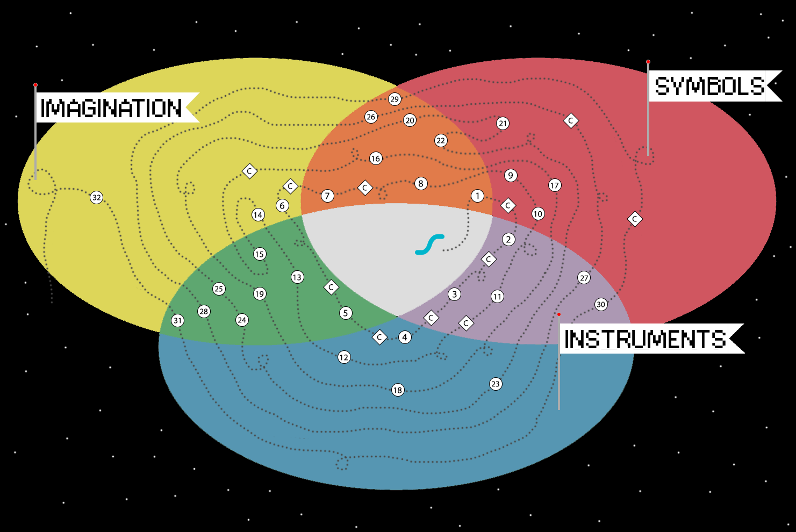

<link href="../styles.css" rel="stylesheet" type="text/css" />

## About Shapes

[In progress... still mostly notes!]

#### A Brief Tour

Shapes is addressed to an adult or young adult who says, in one way or another, "I love music and wish I knew how to play&mdash;where should I start?" 

I've felt for a long time that I had a very specific answer to this question&mdash;one that could be deeply satisfying for the person asking&mdash;but there was no single place I could point to and say, "oh! you could start *here*."

So I've felt something of a personal need to make such a place exist. And as it's started to take form, I've been able to see more clearly that the project of developing a method&mdash;and the impulse to do such a thing in the first place&mdash;is very much about asking what it means to *know* music, whether learning brings about this kind of knowing or acts more as a kind of permission, and about discovering how profoundly the activity of learning music relies on the design of music theoretical ideas.

So now that there *is* a place to point to,  I'll start by taking you on a tour, as briefly as possible, of what you'll find here. And then we'll be in a good position to ask some questions about why Shapes has taken the form it has.

I'll start this tour by showing you the first lesson, which is my favorite way to introduce Shapes:

  <iframe src='https://www.youtube.com/embed/J1Ks_ve2h1I?rel=0' frameborder='0' allowfullscreen></iframe>

  
And with that bit of context, here’s a handy map of the whole method:

 
You’ll find the first lesson where the land of Symbols overlaps with the land of Imagination. The shape draws on a learner’s implicit knowledge and makes it possible to improvise along with songs right away, to access a musical imagination that's already very active.

Of course, the shape is a kind of diagram on an instrument, and so the path continues through the land of Symbols, into the land of Instruments, and then into a land where the instrument begins to disappear, to become internalized as the rational side of a learner's musical imagination.

And like so, this path winds around again and again through the lands of Symbols, Instruments, and Imagination until eventually it falls clear off the edge of the map, and the learner has to go find a different world to explore.

But before then, this path will have weaved its way through five distinct lesson sequences, and I’d like to give you a brief overview of each of those. They are:

- Playing With Songs
- Tactile Reading
- Chord & Key Levels
- Tonescapes & Tensions
- and Reading Imagery

##### Playing With Songs

(...overview...)

(...and point to commentaries, too...)

[Lesson 1]() introduces a shape. [Lesson 2]() and [3]() expand to a full group of shapes and give them names. [Lesson 6]() introduces the anchor note as a way to structure what you play. [Lesson 8]() shows you how to figure out the shape on your own. [Lesson 9]() introduces a form of staff notation. [Lesson 11]() introduces three additional groups of shapes that match the full vocabulary of chord names.

##### Tactile Reading

(...overview...)

[Lesson 4]() introduces a single fingering pattern that allows you to play hands together in any shape, starting on any note. [Lesson 12]() uses this pattern to begin reading a relative notation along with songs, in a way that feels like playing Guitar Hero. [Lesson 18]() and [23]() expand the range of shapes and add features to the notation. [Lesson 27]() replaces pulse dots with rhythmic note symbols. And [Lesson 30]() gives a way to notate outside the shape.

##### Chord & Key Levels

(overview)

[Lesson 5]() introduces the anchor note as a way of structuring the other notes of the shape. [Lesson 7]() shows that changing bass notes along with any other notes of a shape create the recognizable framework for a song. And [Lesson 10]() introduces changing shapes, anchors, and bass notes.

##### Tonescapes & Tensions

(overview)

Designed to be a standalone ear training resource. And best if done in sequence with Reading Imagery. 

[Lesson 13]() introduces a tonescape, a sound as though all the songs that fit with a single shape were boiled into a soup, and recognition of the anchor, one note higher, and one note lower within the tonescape. [Lesson 15]() expands to two notes higher and lower. [Lesson 17]() brings in octave equivalence and switches from higher/lower names to number names. [Lesson 19]() and [21]() introduce different moods that result from the sum of tensions to the anchor. Lessons [24](), [25](), and [28]() expand to recognition of all moods and all tensions. And [Lesson 31]() removes the tonescape.

##### Reading Imagery

(overview)

Actively imagine sounds in tonescapes rather than recognizing them. [Lesson 14]() introduces imagery, [Lesson 16]() uses notation to draw two additional notes out of the tonescape. [Lesson 20]() expands to three moods. [Lesson 22](), [26](), and [29]() expand to hearing all tensions in all moods. And [Lesson 32]() is free play imagery in all moods.

...And so hopefully, this tour will pique your interest to jump in and give it a try, and will have given you a sense of where you might like to explore first.

#### Why a Beginner Method?

Now, if this is a project that's ultimately concerned with ways of understanding music, and with the design of theoretical concepts, it's worth asking: why has it taken this particular form&mdash;a beginner method&mdash;and not a theoretical text, or a research project?

I have to admit that, looking back a few years, I would always get stuck and feel frustrated whenever I tried to write *about* the ideas in Shapes. 

I felt that if I were to have a real conversation with someone about these ideas, we would have to share a certain experiential foundation. Otherwise we would keep getting caught in heady explanations of what Shapes *isn't*, rather than being able to explore what it is.

I was able to find this kind of shared experience through teaching, and especially with people who had no formal training in music. This was also how I was able to develop my own understanding of the ideas, and to develop the project itself.

But it also brings into question what kind of understanding, exactly, this is. It seems less an ability to explain what something is, and more an evolving sense of how it behaves. The understanding is in the experience, and it is a different kind of understanding than exists in the explanation.

And so it seemed necessary to build the minimum foundation that turned this collection of ideas into a sharable experience. It would be a separate project&mdash;and one I'd enjoy taking on&mdash;to situate the ideas in historical context, a research project. But Shapes had to exist in this form, first, in order to invite the possibility of talking about it.

Looking back even earlier, this project also grew out of a frustration with my own lack of understanding

an impulse to teach myself, to go back to the basics

but i didn't trust the basics (the basics had hurt me)

so maybe that's what it's been, a kind of attempt to talk to other people about these questions i care about 

a way i found to connect to people around music, but not directly through *playing* music

except the only way i was able to articulate the questions, or have the conversation, was through this kind of shared experience 

what does this say about theory? about what it means to do theory as a creative project, how closely related it is to composition.

because the way of talking about the ideas really is through the thing, through the experiences the thing affords, and with the people who are, in that moment, drawn into those experiences. 

I remember, in one of our seminars, saying to George Lewis that I thought music theory could be a form of creative art. And he just wasn't having it. It may be creative, he said, but it's not art. 

That conversation stuck with me, though, because I'm still not convinced. Maybe I've been looking for something in between, something that communicates through experience, but that's also in the medium of theoretical concepts. The theoretical concept as an environment for an experience. Isn't that what it is for a musician?

Teaching, of course, turns a concept into an experience. And what when the focus isn't on using established concepts to explore music, but on exploring the concepts themselves, and the experiences they might afford.

So thinking of music lessons as a medium in this way also calls into question if what I was doing can quite be considered teaching. That's the usual title for someone working in the medium of music lessons. But i was more proposing something, and seeing how another person responded.

and i quickly found that the closer to a "beginner" that person was, the more honest our interaction felt. or, the more it was really focused on these questions, experiences

rather than on reconciling them with the standard ideas, the ones i felt like i didn't trust.

This places me, also, in very much the same position as the learner, although perhaps with a little more experience learning. And being in that position also asks me to consider: what is the relationship of this project to my own musical practice? 

Further, it asks me to consider the relationship between that practice and the feeling of needing to develop a method. What is that a reaction to? What is it trying to address? At the very least, it is evidence of some sort of stopping point, some moment of detour from the project of playing. But it's also significant that it includes a desire to direct the experience toward others, toward other learners, rather than only toward my own playing.

There may be a bit of an attempt to try over, to understand more of how it might have been if only... but projecting that potential onto others. And yet, it's also a project of rebuilding enough of a foundation for myself that makes it feel okay to have a musical practice. That, also, has only started to become apparent once this method began to exist in a form I could point to.

But in any case, the factors that led to that moment of detour are significant, because they point to exactly the problems, as I saw them, that Shapes is attempting to address.

so what were the confusions? the sticking points? the things that at one point told me i couldn't play, the things i was worried would tell other people they couldn't play?

i remember a feeling of disconnectedness. a lot of ideas and skills that didn't cohere, and an absent feeling of fluency

i had had a good education, supposedly, but the connections between what i heard, imagined, could read, write, play, weren't there.

i traced the problem to theory

the most innocuous things we learn from the very beginning: this is the note C

sow tiny seeds of confusion

that are never really resolved, at least for a typical learner

​	(creates a priority to have more access to the underlying system)

or "middle C," all the things that embeds

for me, the place where this became most consciously unbearable was chords

​	(my childhood music lessons were in something like jazz piano)

it didn't make any sense that chords were composite objects made up of parts, notes

and were identified by particular structures of these notes, triads

and yet could take completely different forms, and still somehow retain their same names

there's no way, in this case, that chords could be particular structures, made up of notes

it had to be the other way around, contexts expressed by notes, by particular structures implied by them, but not made up of them

perhaps made up of the aggregate of all possible particular structures

around the same time some years ago i'd locked myself in a room to see if i could figure out how to play the piano

i was doing the typical things, playing things through every major and minor key...

​	("woodshedding," but again, not trusting the concepts)

and i was also trying to make some kind of account for what, even, are all the types of chords that seem to have their own names? a minor 6th? minor 6th add 9? minor 9th...?

around the same time, i switched from playing through major and minor keys to their shared key signatures

and then one day i noticed, you'd think obviously, that key signatures with the same number of sharps or flats are symmetrical opposites of one another on the keyboard.

and that was the day shapes were born. or the seed of shapes anyway

the keyboard became a playable diagram, the symmetry allowed ideas to be grouped and reduced

and the nature of those ideas changed, they were no longer attached to their names in quite the same way

they could exist without names, in a way that clarified and organized the names

this diagram showed the entire (virtual) tonal space at once

​	in ways that a key signature doesn't, it's abstracted, and it also depends on the process through which you've abstracted that idea, like as a kid learning "first F-sharp then C-sharp..."

and it also matched a symmetry of hands

moreover, all this felt closer to the way i had always understood music, or had wanted to, but couldn't reconcile with the ideas I'd been taught.

lots fell out of this. but when did playing with songs start?

#### The Shapes Playlist

that is, playing along with songs. the next part was the playlist. 

people like to complain about pop songs having nothing much going on harmonically

which of course is a somewhat limited view, maybe not so far off of saying the same thing of modal music...

but one amazing quality of most pop songs is that ...

#### Software as a Medium

so the second part was songs, and that's when the first app happened. that's when to talk (briefly) about the role of technology in this project.

#####  Why Software?

if you want to have somebody play along with a song, and a sound, and instrument, etc., all need to be in the same place, it's a technical hurdle and a barrier to entry for many learners.

You'd need a playlist of songs, your computer, a stereo, controller, etc., set the levels, choose a song... so the only way to do it at that time was on iPad. There wasn't a good enough Web Audio API even a few years back...

So on one screen, you could have a keyboard, music video, sound, playlist, and lesson together. So this was part of making an experience of the idea possible... now there's the technology, easily, to do that in a web browser.

 But you don't want the technology to do too much for you...

##### Data Model

the analysis model for songs developed alongside the ideas and needs of the method. 

pedagogical choices behind design of the software, not only the interface...

#####  Detection?

This had to be done manually. The idea that you could detect this stuff automatically, but no automatic approach is good enough, reliable enough to really work in a learning context. It has to be right. 

So, for example, there will be songs with only three notes in it, that's the whole song. So there's not enough information in the audio file for a pitchmark detection algorithm to know what the context is.

And it's your brain that fills in the rest. It's an interesting problem of MIR. It also draws on the style. It would be possible to detect, in principle, but it would have to say, for example, this is hip hop, and if it's the same three notes but in a country song, it might be a different shape.

#####  Blending the Instrument with the song

Then the instrument is initially  set for you, because one way the song won't sound like it fits is if the instrument doesn't fit with the song. So when that's in place, then you can pay attention to the fit of the notes.

But if the fit is close, you can also fiddle with it--turn the volume up or down a little, try a different sound. That's wading into sound design, which is certainly a part of playing, but it's not the focus right now, we're focusing on the tonal stuff, which generalizes across songs.

#### Methodology

the third part is zippering this all together, teaching, adjusting, refining, tweaking...

teaching through it, seeing what works...

which goes back to the basics method, it's scope, purpose

why it mattered for me to put it in a form

the choices that came from this process, length of the lessons, finding the voice,

not distinguishing standard from nonstandard terms, like "anchor."

separating potential questions about the lesson from the lesson itself. The lesson is the object. So that I can develop the questions over time, separately from the lessons. 

focus: he lessons talk only about what to do at this moment, not what will happen going forward, stuff that's not relevant to the experience right now.

#### Theory / Philosophy Questions?

there are some...

#### Going Forward

and now what kinds of questions are possible going forward
