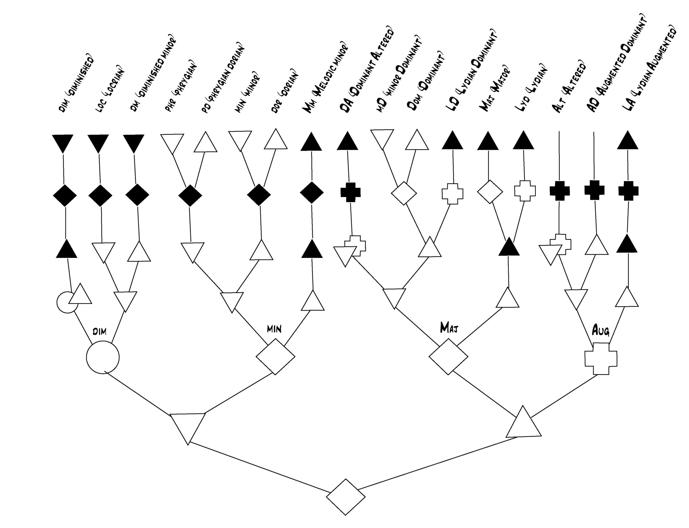

## Chord-Modes

Throughout the Tonescapes and Imagery lessons, you've become very familiar with a spectrum of *moods*, and with the tensions that make them up. The moods align very closely with the standard concept of *modes*. And they also give you a way to understand families of *chords*. 

You've been naming the moods based on a spectrum of "light" to "heavy" tension, and this has given you a useful way to relate the moods to one another, and to understand the collection of moods as a whole. The standard mode names that correspond to this spectrum of moods are:

|Mood|Mode|
|-|-|
|Triple Light|Lydian|
|Double Light|Major|
|Single Light|Dominant|
|Neutral|Dorian|
|Single Heavy|Minor
|Double Heavy|Phrygian|
|Triple Heavy|Locrian|

 

Mode names are most often used to describe the overall shape and anchor of a song. So, if a song is in the [Top Shape](../lessons/03-a-group) and the anchor is [*Pe*](../lessons/31-independent-solfege), the mood is Single Heavy, and you would say that the song is in the Minor mode.

But describing a song's mode at the key level doesn't always [accurately represent](chord-and-key-levels) your experience of the song's context. So you can also use modes&mdash;as combinations of a shape and anchor&mdash;to describe changes at the chord level.

Naming a chord level change by its mode is also a way to name particular chord [structures](musical-structures). In the tree diagram below, each mode is built up by skipping every other tension number, beginning from the anchor. To see how this works, find the Dorian mode at the top of the tree, slightly to the left side of the center.

Beginning from the base of the tree, you can build up each consecutive tension until you arrive at the complete Dorian mode. A diamond represents a neutral tension, an upward-facing triangle represents a light tension, and a downward-facing triangle represents a heavy tension.

So, the diamond at the base of the tree is the anchor, and it is neutral. Moving upward toward the full Dorian mode, the next tension will be a heavy 3rd. This is followed by the neutral 5th, and heavy 7th.

At this point, if you continue to skip every other note, you will extend beyond [an octave](../lessons/17-switch-to-number-names) to the light 9th, which is the octave equivalent of the light 2nd. Then a neutral 11th (neutral 4th), and light 13th (light 6th). And now you've collected all the tensions that make up the Dorian mode.

 

If you come across a chord structure, for example, that only contains tensions up to the 9th, you would have to decide whether that chord is Dorian or Minor, by filling in the 11th and 13th that sound like the [best match](../lessons/08-matching-a-shape). And if your chord structure only went up to the 7th, you would have still more options for describing its chord-mode.

One of those options, however, the "Phrygian Dorian" mode, is not one of the mode names that matches the mood names you know. And there are several other chord-mode names at the top of the tree that correspond to moods other than those you've been listening to.

But you *have* gotten to know the ingredients for these other moods. They are the moods of the three [other groups of shapes](../lessons/11-groups-of-shapes) that you played with early on. They're made up of the same [light and heavy tensions](../lessons/28-all-moods-and-tensions) that make up the moods you *do* know. And if you haven't gotten there already, you'll have a chance to [play around](../lessons/32-free-play) inside their tonescapes as well.

All you need now to complete a vocabulary of chord families are the rest of the chord-mode names that correspond to the light and heavy mood names. These are:

 
**Second Group Shapes**

|Mood|Mode|
|-|-|
|Quadruple Light|Lydian Augmented|
|Double Light|Lydian Dominant|
|Single Light|Melodic Minor|
|Neutral|Minor Dominant|
|Single Heavy|Phrygian Dorian|
|Double Heavy|Diminished Minor|
|Quadruple Heavy|Altered|

 
**Third Group Shapes**

|Mood|Mode|
|-|-|
|Light|Dominant Altered|
|Heavy|Diminished|

 
**Fourth Group Shapes**

|Mood|Mode|
|-|-|
|Neutral|Augmented Dominant|

 

If you already have some experience with chords, this tree of chord-modes will be an opening into yet another way you can understand the ideas in Shapes. Perhaps it will even lead you to begin considering why we build our chords by skipping every other note from the anchor in the first place, and if there might perhaps be a different way that feels more intuitive...