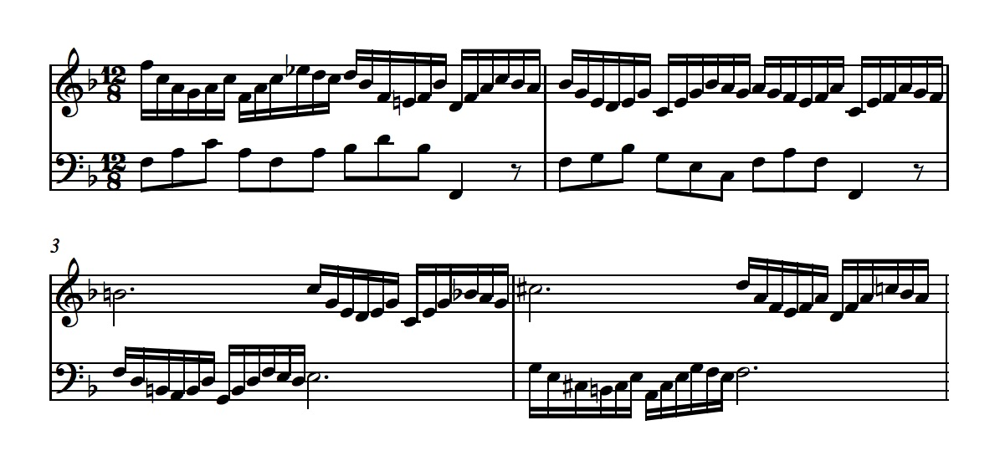
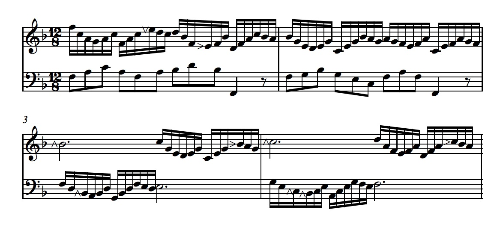
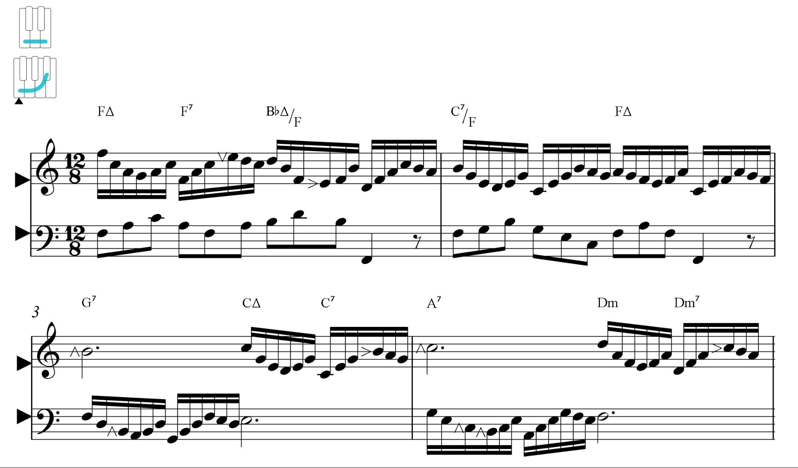
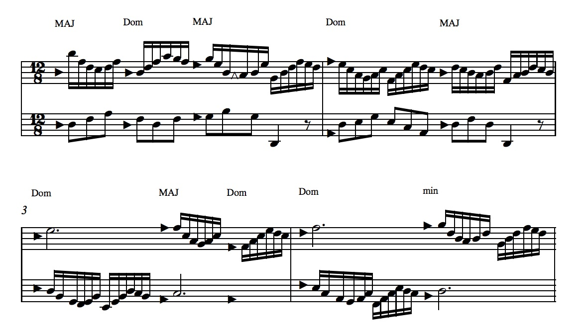
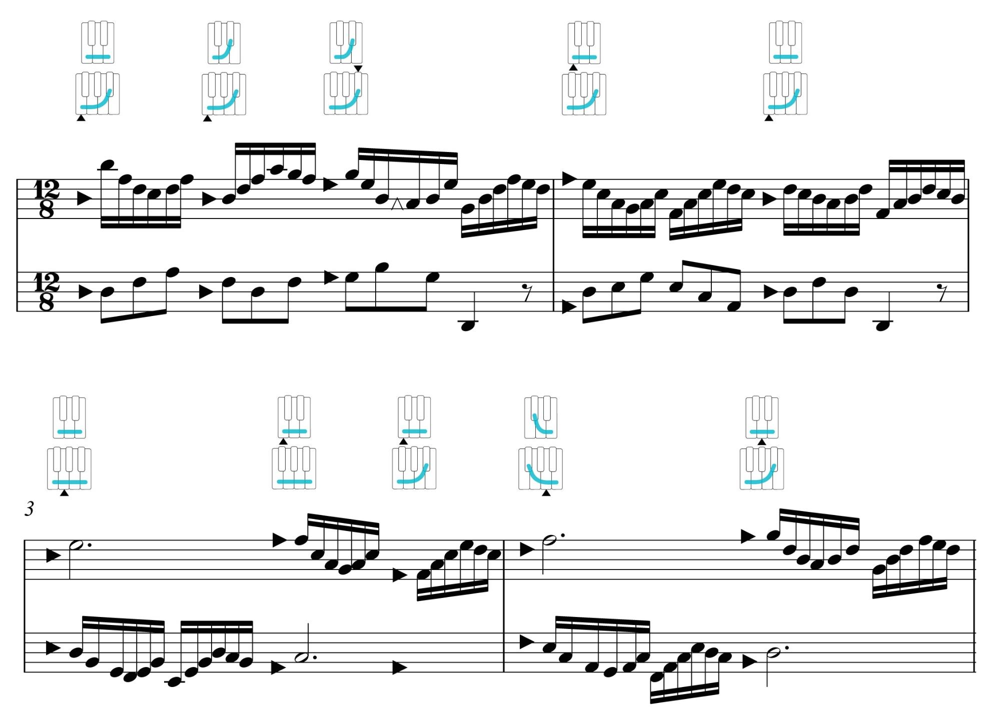
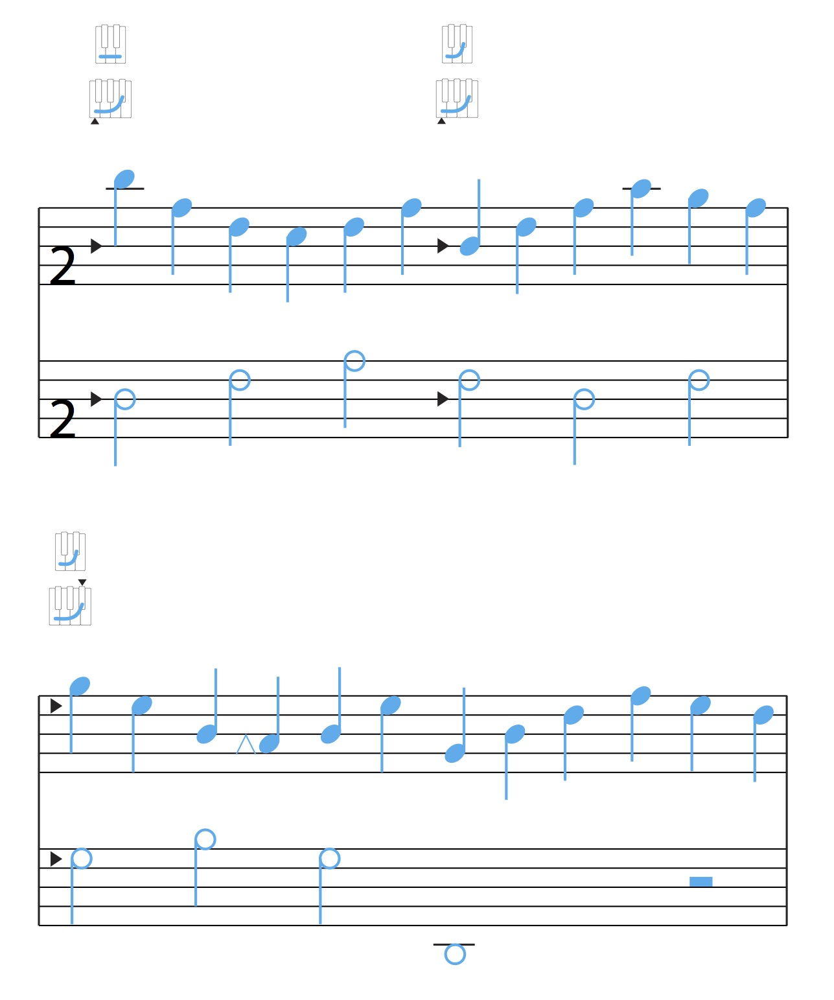
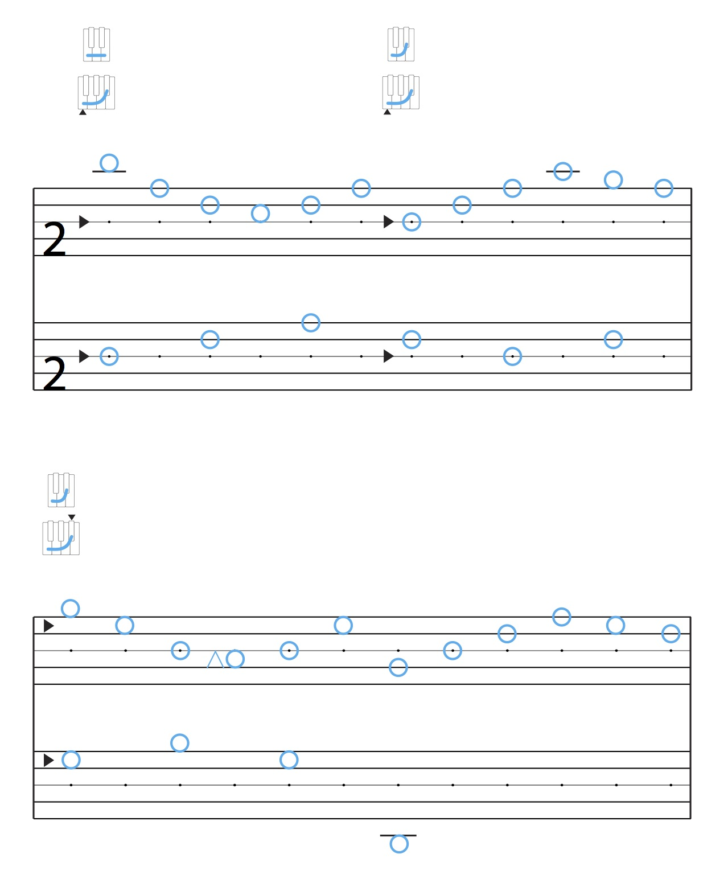
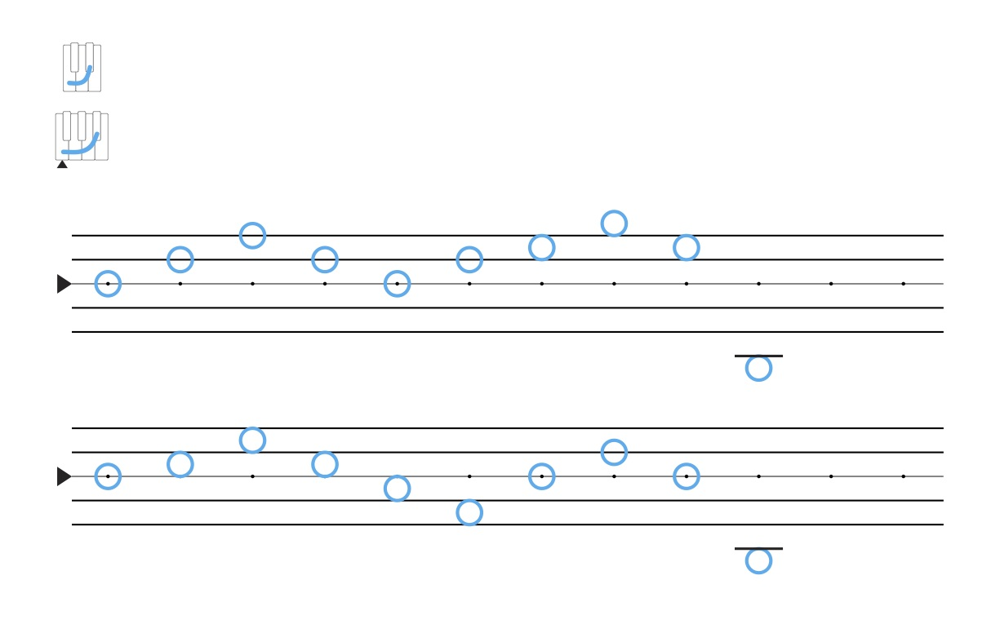
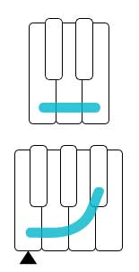

## Shape and Standard Notation

Throughout these lessons, we've been building a form of music notation that can represent the notes we play, and the contexts for those notes. This began with a single shape, and progressed, through a way of representing changing bass notes and structures to the anchor, to something that begins to look more and more like standard music notation. 

I'd like to try, as an experiment, to go in the other direction&mdash;starting with standard music notation and progressing backwards from its surface layer, until we arrive at a shape. This may give us some additional insights into the relationship between shape and standard notation.

  

  

The notation above is a short excerpt from Bach's F Major Prelude. This may be about as close as Bach came to making a music video.

  

  

Peeling back one layer, the accidentals are replaced with [incidentals](../lessons/30-incidentals). The E-flat and E-natural in measure 1 become "down" and "return to" incidentals as expected, but the B-naturals in measure 3 turn out to be departures "up" from the key signature. The B-flat later in that measure is a "return to," and both the C-sharps and the B-natural in measure 4 are departures "up" from the shape. The incidentals show us departures from the key signature without considering the grammar of note names. The same idea of "up" is what changes a flat to a natural, and a natural to a sharp.

  

  

This next notation replaces the key signature with a shape and anchor at the [key level](chord-and-key-levels), and adds standard chord symbols to describe moments of change at the chord level.

  

  

The combination of the key-level shape and anchor were a complete expression of the Major mode. But the standard chord symbols expressed particular [musical structures](musical-structures). Both are expressed here as [chord-mode](chord-modes) symbols, so that we have a complete sense for the shape and anchor at the chord and key levels.

  

  

This next notation is perhaps the most elegant midpoint between shape and standard notation. The key level clefs are removed, making it possible to read the notation beginning in any shape. The letter names in the chord-mode symbols are also moved to chord-level anchor clefs. The key-level context is removed entirely, bringing our attention to context at the chord level. 

And because of this shift to the chord level, only one incidental remains. This suggests that the other accidentals in the original notation were not departures from the collection of notes that sounded like they fit at that moment in the music, but rather, from a theoretical context at the key level.

  

  

From here, we can replace the chord-mode names with graphical shapes and anchors. While this allows us to read the notation without using symbolic names, it also means that we can no longer read the notation beginning in any shape. It is fixed to the shapes represented by the keyboard, although we're still reading the relationships of notes inside those shapes.

  

  

Peeling back the idea of *measure*, we no longer have an upper number in the time signature, and we're left with notation that [assigns different symbols](../lessons/27-making-time-relative) to a regular pulse in the music.

  

  

Above, rhythmic note symbols disappear, and the temporal relationships between notes are represented as evenly-spaced pulse dots on the staff. The lower number of the time signature, however, still allows us to assign, in this case, *two* dots to a single pulse, so that we can represent notes that move at twice the rate of the pulse.

  

  

Without the lower number of the time signature, we have a [simple shape notation](../lessons/09-notes-in-time). This notation uses an anchor clef to map the shape and anchor to the staff, and pulse dots to represent the relationship between note events and the song's pulse.

  

  

And finally, we've arrived at a single shape and anchor. Which, as we've just discovered, represents the potential for Bach's F Major Prelude.
